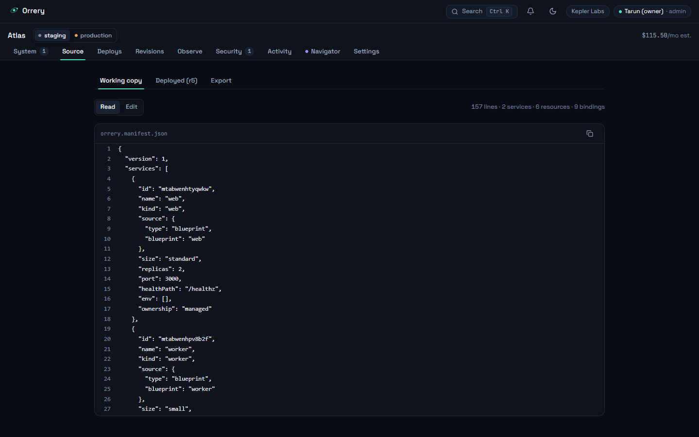
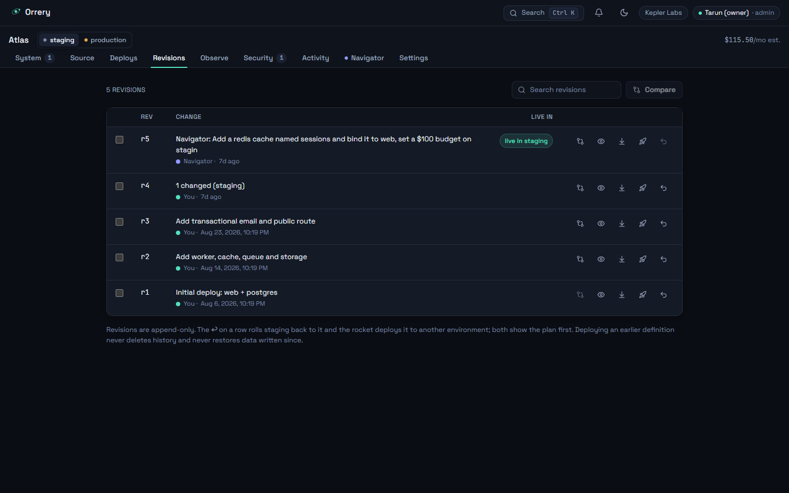
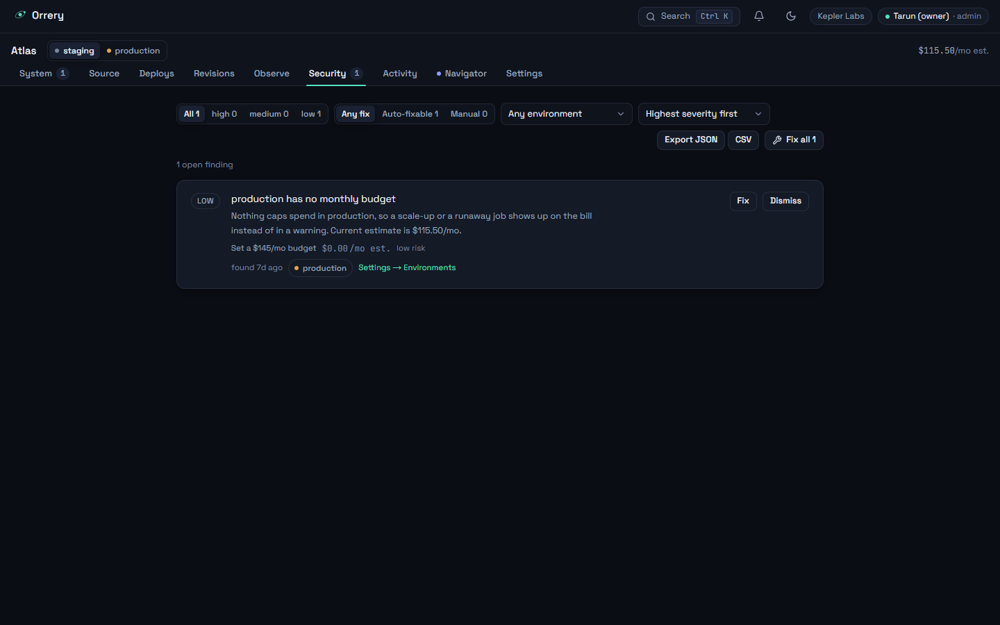

# Zenith

**Your stack, clearly in view.**

Zenith turns an application into a living, explained system: services,
resources, routes, and typed **bindings** in one canonical manifest that the
visual **System Map**, the **Source** view, the REST API, and the **Navigator**
agent all share. Every change becomes a readable plan with a cost delta before
it applies; every deploy streams durable progress, ends in an unmissable live
URL, and leaves a rollback point. Exports — manifest, real Terraform, and an
operations README — mean there is no lock-in.

| | |
| --- | --- |
| **Tests** | 932 across 88 files (`npm test`), plus an end-to-end smoke script |
| **Actions** | 52 typed actions in one registry — every surface calls these |
| **Providers** | Sandbox and LocalStack available · AWS preview · Kubernetes, GCP, Azure planned · Oracle coming later |
| **Stack** | Next.js 15.5.24 · React 19.1.0 · TypeScript strict · Tailwind v4 · optional Supabase auth |
| **Runs at** | `http://localhost:3400` — one process, one data directory |
| **License** | No license file yet |

The platform is now Zenith; Gimbal remains its Navigator character. Existing
`ORRERY_*` configuration, storage namespaces and export filenames remain compatible.
See [the identity and compatibility notes](docs/BRANDING.md).

## Start with Gimbal

New accounts enter the optional starter at `/onboarding`: create or choose a
workspace, select a connection, then create an editable blueprint project or
import a file. LocalStack offers a supported S3/SQS starter; AWS is explicitly
plan/export Preview. Nothing is deployed by completing setup.

Returning members can resume setup or open **Guide** in the application header
or command palette. `/guide` explains the product screens using actual workspace
records. Reading a guide never marks infrastructure verified. Resume records
are scoped to the signed-in user and workspace; import contents and credentials
are not saved in browser storage.

---

## What it is

Zenith is one place to describe a small SaaS system, price a change before you
make it, ship it, and then watch it. You draw services, databases, queues and
routes on a map; Zenith keeps them in a single typed manifest and derives
everything else from it — the JSON you can edit by hand, the REST API, the cost
estimate, the security findings, and the plan for the next deploy. Nothing
mutates that manifest except a registered action, so a button, a `curl`, and
the Navigator agent all take the same audited path. Every deploy runs as a
durable state machine that streams its steps, survives a refresh, and ends in a
live URL with a rollback point behind it. And you can leave at any time: the
export bundle is your manifest plus real Terraform plus a README for operating
the system without Zenith.

## What it is not

- **The sandbox provider is simulated.** Deploys, logs, health and cost against
  it are generated — realistic, deterministic, labeled `simulated` on every
  screen that shows them. No container starts.
- **AWS is Preview: plan and export only.** Zenith generates real, usable
  Terraform/OpenTofu for your manifest, but applying from Zenith is disabled and
  **no code path reads your AWS account** — so drift and discovery refuse rather
  than return a reassuring empty answer.
- **LocalStack exercises S3 and SQS, and only those.** Buckets and queues really
  are provisioned and read back; Postgres, Redis, containers, load balancers, DNS
  and email run as labeled local simulations, because LocalStack Community cannot
  emulate them.
- **It is not multi-process.** Both stores — `.data/state.json` and
  `.data/control.sqlite` — assume one writer, so this is a repo you run
  locally, one process at a time. There is no pricing and there are no
  customers.
- **The hosted-apps subsystem is in the repository, not in the world.**
  `src/lib/hosted` really does serve private apps on `<slug>.<ZENITH_APP_DOMAIN>`
  behind a grant list, off `ZENITH_HOSTED_MODE=1` by default — but it runs on
  the host you start it on. Nobody operates a hosted Zenith for you.

---

## Quick start

Full setup, the complete environment table and troubleshooting live in
**[docs/RUNNING.md](docs/RUNNING.md)** — that file is the source of truth. The
short version:

```bash
npm install
npm run setup
npm run dev
```

Open <http://localhost:3400>. `npm run setup` is idempotent: it checks Node and
Docker (reporting, never requiring), copies `.env.local.example` to `.env.local`
if you have none, seeds the "Kepler Labs" demo workspace when the data directory
is empty, and prints the commands that make sense for your machine. With no keys
configured Zenith runs in **local demo mode** — one local user who is admin of
everything, no sign-in — and that is a complete install: every deployment path
works against the sandbox provider.

When something misbehaves, this reports what is configured, what is reachable,
and the fix for each thing that is not:

```bash
npm run doctor
```

### With LocalStack (real S3 and SQS)

```bash
npm run localstack:up
npm run dev
```

Then create a connection with the **LocalStack** provider and deploy to it.
`npm run localstack:down` stops the container, `npm run localstack:logs` tails
it. LocalStack Community does not persist across a restart — re-deploy the
environment after bringing it back up.

### As a container

```bash
cp .env.local .env
docker compose --profile app up --build
```

This starts LocalStack **and** Zenith, app on <http://localhost:3400>, data on a
named volume at `/data`. `npm run docker:build` / `docker:up` / `docker:down`
wrap the same thing. Two things to know: `NEXT_PUBLIC_*` values are baked in at
build time and Compose reads them from `.env` only, so auth keys mean a rebuild;
and the container starts with an empty database, so it opens at `/onboarding`.

### Test accounts

Created by `npm run seed:users` once Supabase keys are in `.env.local`. Local
credentials for a local demo — never point `seed:users` at a project with real
users.

| Email | Password | Role |
| --- | --- | --- |
| `arnav@orrery.test` | `orrery-owner-2026!` | admin |
| `claude@orrery.test` | `orrery-claude-2026!` | editor |
| `sai@orrery.test` | `orrery-sai-2026!` | editor |

---

## A tour

### Overview — `/overview`


The workspace home. Each project card carries two numbers Zenith refuses to
conflate — what the working copy would cost and what the deployed revision costs
— plus waiting changes, open findings, and a chip per environment showing its
live revision and pending count. The budget meter turns red when the projection
passes the cap, not after the bill arrives.

### System Map — `/p/<project>`


The centerpiece, and the clearest expression of **a map that cannot lie**:
layout is computed from the graph into three strata — Routes, Services,
Resources, left to right — so nobody can drag a node into a position implying a
topology the manifest does not have. Nodes show status, kind, size and their own
monthly estimate; edges are bindings labelled with the capability they grant.
Undeployed changes render ghosted and dashed (the `new` badge on `res1`), and a
persistent pill counts them with their cost delta and opens the Changes drawer —
the plan-first law made visible: no path from an edit to a deploy skips review.

### Inspector — the right drawer on the map


Selecting a node opens the inspector: config, environment variables and secret
references, the bindings it participates in, and the operations available on it.
Every field explains itself in one line, every cost-bearing field prices itself
as you type (`$28.00/mo est.`), and no edit applies on blur — it becomes a
pending change with a plan behind it. Controls above the caller's role are
disabled with the reason, never hidden.

### Source — `/p/<project>/source`



The same manifest the map draws, as JSON you can read, edit and validate.
Working copy and deployed revision sit side by side as tabs, and Export produces
the bundle — manifest, real Terraform, operations README. Saving goes through
`project.updateManifest` like every other mutation, so hand-editing the JSON is
not a back door around plans or the audit trail.

### Deploys — `/p/<project>/deploys`


Every deployment, in flight or finished, with the actor that started it —
including the Navigator. The detail pane is the durable state machine rendered:
four phases, every step with its real duration, a "What changed" link back to the
changeset. Progress streams over SSE and replays from a sequence number, so a
refresh mid-deploy resumes rather than restarts. A failed step marks the rest
skipped and offers rollback — disabled, with the reason, on a first deployment.

### Revisions — `/p/<project>/revisions`



Every deployed definition, append-only, with any two comparable. Each row can be
compared with the one before it, viewed as JSON, loaded into the working copy,
promoted to another environment, or rolled back to — and the last two show the
plan first. The footer is the honesty law in one sentence: deploying an earlier
definition never deletes history and **never restores data written since**.

### Observe — `/p/<project>/observe`


Health, drift, application logs, cost and alerts for one environment, stacked as
cards. Health reads the same inputs the alert evaluator does, so a health card
and an alert can never disagree. Drift compares the deployed revision against
what the provider's `observe()` actually finds — real against LocalStack, seeded
and labeled against the sandbox, a refusal against AWS Preview, which names
`terraform plan` as the honest way to see drift today. Note how many `simulated`,
`synthetic` and `estimate` chips this one screen carries: that is the point.

### Security — `/p/<project>/security`



Findings derived from the manifest, filterable by severity, environment and
whether a one-click fix exists. A fix is not a special code path — it is a
registered action with its own plan, cost and risk, which is why the row can
state `$0.00/mo est.` and `low risk` before you press it, and why a fix that
would be refused is never offered. Findings can be resolved, dismissed with a
reason, or reopened.

### Activity — `/p/<project>/activity`


The audit trail: one row per action, human and agent in the same list, each with
its action id, actor, recorded input and result. The header says exactly how much
of the trail is loaded rather than implying it is everything, and separates the
filters that query the whole log from the search that only reads what is loaded.
A Navigator step and a click are indistinguishable here except for the actor —
the property that makes the agent safe to run at all.

### Navigator — `/p/<project>/navigator`


State a goal in plain language; the Navigator turns it into a list of registered
actions with rationale, risk and cost, and executes them under an autonomy dial
with five levels — observe, plan, approve, bounded, autonomous. The chip reads
`deterministic planner` because that is what runs without `ANTHROPIC_API_KEY`;
with a key it reads `language parsing · <model>`, and each run still says which
half read the goal. Steps obey each environment's approval policy, land in the
audit trail, and a run whose steps outrank the person who pressed Run is refused.
Nothing here can do anything you could not do yourself from the map.

Gimbal is the Navigator's quiet visual companion: a simplified face at the
center of three gyroscope rings. A surrounding glow communicates planning
(purple), awaiting approval (yellow), applying (blue), verified (green), or
blocked (red), alongside a plain-text status. The rings explore while planning,
hold a concentric alignment for approval, coordinate while applying, and adopt
an interrupted pose when blocked. Transitions preserve their orientation.
Hover and tap add a glance or greeting, including in the SVG fallback.
The procedural renderer pauses offscreen, respects reduced motion, and caps
rendering at 30fps (20fps in low-power mode). Motion settings retain the canvas;
a GPU failure gets one retry before keeping the functional fallback. Visit
[`/gimbal`](http://localhost:3400/gimbal) for the interactive preview.

Green requires recorded, fresh provider evidence, not merely successful actions.
Whole-run verification currently covers deployment-only workflows (optionally
with planning/investigation) targeting LocalStack's managed S3/SQS subset with
default configuration and no services, routes, or bindings. Read-only checks
confirm intended resource presence and removals, and remain available in run
history. Sandbox simulations and unsupported or incomplete checks stay neutral;
failed provider checks show blocked. This verifies local emulation, not real AWS.

### Settings — `/p/<project>/settings`


Eight sections on one scrolling page. **Workspace** renames through a plan like
anything else, and says the slug will not change so links keep working.
**Members** shows who is in the workspace, what each role may do, and how invites
and operator-set Supabase role claims interact. **Environments** covers rename,
clone, region, budgets and approval policies; **Connections** lists the exact
permissions each one holds; **Secrets** is the reference-only view of the
encrypted store; **Alerts** holds the workspace's webhook, Slack and email
delivery channels (the rules that use them live on Observe); **Export** is the
take-it-and-leave bundle. The **Danger zone** deletes the project — admin only,
typed-name confirmation, a plan listing the exact counts that go, a plain
statement that nothing in your cloud is torn down, and a refusal while a
deployment is in flight.

---

## How it works

**One model, one path.** A project's canonical **manifest** — services,
resources, routes and typed bindings — is the only source of truth. Every
mutation goes through the **action registry** (`src/lib/actions`): 52 typed
actions, each declaring its input schema, its required role, whether it mutates,
and a `plan()` returning a summary, cost delta, warnings and risk before
anything happens. `runAction` enforces the role on execute, applies idempotency,
and writes an audit row whether the action succeeded, failed or was denied. The
map, the Source editor, the REST API and the Navigator are all just callers.

**Deploy pipeline.** Working manifest → `diffManifests` → **Changeset**
(explanations, cost delta, warnings) → `deploy.apply` → policy check (approval
required? over budget?) → the **engine** creates a Deployment and asks the
**provider** for its steps → a 250ms ticker executes them idempotently,
appending every transition to an event log → verify phase → succeeded, with
outputs, a live URL, a recorded revision and a rollback point.

**Roles and workspaces.** Multiple workspaces per install, one current workspace
per user, resolved from an httpOnly cookie re-checked against membership on every
read. Roles are `viewer`, `editor`, `admin`; planning stays open to every member
so anyone can see what an action would do before asking for it. Auth is optional:
with no Supabase keys Zenith is one local admin user, and says so.

**Secrets.** The manifest holds only `vault:<KEY>`; the value lives in
`<ORRERY_DATA>/secrets.json` under AES-256-GCM, and reaches no diff, revision,
audit row, browser payload or export. Without `ORRERY_SECRET_KEY` the store is
*not configured* and every write is refused saying so — it never degrades to
plaintext.

**Alerts.** Four rule kinds per environment, evaluated every 15s and on every
read of the alerts route, one open event per rule, resolved when the condition
clears. Delivery to webhook (HMAC-SHA256 signed), Slack and email is real and
retried three times with backoff; every attempt is recorded on the event and the
channel, so a failure is a row with a reason rather than a silent drop.

**Drift.** The deployed revision against what the provider's `observe()` reads
back, as `missing` / `changed` / `extra` items — strictly read-only, with no
store write, audit row or cache. Silence means "not looked at", never "matches".

**The streaming payload.** Every successful save emits an in-process change event
naming the projects it touched; `GET /api/projects/:id/stream` re-sends the
project payload — same body and hash as the GET — only when that hash moves.
Screens keep a 5s poll behind it and fall back when the stream is not delivering,
so degradation is a slower refresh, never a frozen screen.

**Storage, and its ceiling.** An embedded JSON snapshot plus append-only JSONL
logs behind one repository module, with revision manifests split into cold
per-file storage behind a small LRU. `state.json` is rewritten in full on every
save, which is exactly why **one process per data directory** is enforced at
boot, and why the change emitter is a `globalThis` `EventEmitter` rather than a
message bus. Swapping in SQL is contained to `src/lib/db`.

Details: [docs/ARCHITECTURE.md](docs/ARCHITECTURE.md) for the diagram and the
ADRs, [docs/CONTRACTS.md](docs/CONTRACTS.md) for the action catalog, the API and
the invariants, [docs/DESIGN.md](docs/DESIGN.md) for the product laws.

---

## Providers

| Provider | Status | Deploys | Drift & discovery | Export |
| --- | --- | --- | --- | --- |
| **Sandbox** | Available | Simulated, fully working, labeled | Simulated and labeled; references it writes are prefixed `sim://` | Yes |
| **LocalStack** | Available | Real for S3 and SQS; other kinds run as labeled local simulations | **Real** — reads the edge endpoint, and reports nothing about the kinds it only simulated | Yes |
| **AWS** | Preview | No — plan only; applying is deliberately disabled until credentials support ships | Refuses. No code path reads your account, so it will not invent an answer | **Real Terraform/OpenTofu** |
| **Kubernetes / GCP / Azure** | Planned | No — visible in the picker, not selectable, and refused at plan time before any revision is written | No | No |

Everything imported by live discovery lands as a **referenced** resource: Zenith
draws it and lets services bind to it, but never provisions, changes or deletes
it, and it adds nothing to the cost estimate. There is no path from discovery to
`managed` — adoption cannot become ownership by accident.

---

## Configuration

Everything is optional; `npm run doctor` reports which are set and what each one
turns on, and an invalid value fails at boot naming the variable and what it
accepts, never a silent default. Full table and build-time caveats in
[docs/RUNNING.md](docs/RUNNING.md); the shape to copy is
[.env.local.example](.env.local.example).

| Variable | Purpose | Default |
| --- | --- | --- |
| `ORRERY_DATA` | Data directory: snapshot, revisions, event and audit logs. One process per directory | `./.data` |
| `ORRERY_FAST` | `1` collapses simulated step durations; used by tests and smoke | `0` |
| `ORRERY_LOCALSTACK_ENDPOINT` | LocalStack edge endpoint | `http://localhost:4566` |
| `ORRERY_LOG_LEVEL` | `debug` \| `info` \| `warn` \| `error` | `info` |
| `ORRERY_LLM_MODEL` | Model for the Navigator's language front-end; used only with `ANTHROPIC_API_KEY` | `claude-opus-5` |
| `ORRERY_SECRET_KEY` | 32 bytes (base64 or hex) encrypting the secret store. Unset means every secret write is refused, saying so | unset |
| `ORRERY_STEP_TIMEOUT_MS` | Per-step deadline for a deployment step | `300000` |
| `ORRERY_SMTP_URL` | SMTP server for email alert channels. Carries the password, so it is never echoed | unset |
| `ORRERY_ALERT_FROM` | From address on alert email. Required alongside `ORRERY_SMTP_URL` | unset |
| `ORRERY_SEED_FORCE` | `1` lets `npm run seed` wipe a data directory it did not create | unset |
| `ORRERY_PORT` | Host-side port, read by `docker-compose.yml` only | `3400` |
| `NEXT_PUBLIC_SUPABASE_URL` | Supabase project URL. **Build-time** | unset |
| `NEXT_PUBLIC_SUPABASE_PUBLISHABLE_KEY` | Publishable key; `…_ANON_KEY` also accepted. **Build-time** | unset |
| `NEXT_PUBLIC_SUPABASE_OAUTH_PROVIDERS` | Comma-separated `github`, `google`. **Build-time** | empty |
| `NEXT_PUBLIC_SITE_URL` | Absolute origin for OpenGraph and share-card URLs. **Build-time** | `http://localhost:3400` |
| `SUPABASE_SERVICE_ROLE_KEY` | Server-only, used by `npm run seed:users` | unset |
| `ANTHROPIC_API_KEY` | Enables Claude language parsing in the Navigator | unset |

---

## Development

### Scripts

| Script | What it does |
| --- | --- |
| `npm run dev` | Dev server on 3400 |
| `npm run build` | Production build (`output: "standalone"`) |
| `npm start` | Serve the production build on 3400 |
| `npm run typecheck` | `tsc --noEmit` |
| `npm run lint` | ESLint over the repo |
| `npm test` | Vitest: 889 tests, node and jsdom projects |
| `npm run verify` | typecheck + lint + test + smoke, in order — what CI runs |
| `npm run smoke` | End-to-end: blueprint → deploy → URL, chaos failure → rollback |
| `npm run setup` | First-run setup; idempotent |
| `npm run doctor` | Configuration and reachability report, with a fix per problem |
| `npm run seed` | Reset to the Kepler Labs demo workspace (**wipes the data directory**) |
| `npm run seed:users` | Create the Supabase test accounts; idempotent |
| `npm run screenshots` | Recapture `docs/screenshots/*.png` against a running server |
| `npm run supabase:start` | Local Supabase stack in Docker |
| `npm run supabase:stop` | Stop it |
| `npm run localstack:up` | `docker compose up -d localstack` |
| `npm run localstack:down` | Stop the LocalStack container |
| `npm run localstack:logs` | Tail LocalStack |
| `npm run docker:build` | Build the app image (`--profile app`) |
| `npm run docker:up` | Start LocalStack + Zenith detached |
| `npm run docker:down` | Stop and remove them |

### Quality gates

`npm run verify` runs the four gates in order, and they all run offline.
Fonts are self-hosted, so `npm run build` no longer fetches Google Fonts.
`.github/workflows/ci.yml` runs `build` and `docker` as separate
`continue-on-error` jobs. Point tests and scripts at a throwaway directory (`ORRERY_DATA=$(mktemp -d)`)
so a run never touches your working `.data/`.

### Screenshots

`npm run screenshots` drives the installed Chrome through `playwright-core`
against a **running** server, signs in with the seeded admin account, and
captures every screen above at 1440×900 into `docs/screenshots/`. Use a
production build (`npm run build && npm start`) rather than `next dev`, or the
first hit on each route compiles while the shutter is open. `ORRERY_URL`,
`ORRERY_SHOT_EMAIL`, `ORRERY_SHOT_PASSWORD`, `ORRERY_SHOT_PROJECT` and
`ORRERY_SHOT_ONLY=navigator,settings` override the defaults; one screen failing
never costs the others. See [scripts/screenshots.ts](scripts/screenshots.ts).

### Repository layout

Two documents, kept in one place each so they cannot disagree with this one:

- **[docs/ARCHITECTURE.md](docs/ARCHITECTURE.md)** — the annotated `src/lib`
  tree in dependency order, including the `hosted/` subsystem, plus the
  pipeline diagram and the ADRs.
- **[docs/MODULE-MAP.md](docs/MODULE-MAP.md)** — one line per directory: what
  it owns and what it may import, the invariants, the import cycles that are
  currently open, and a "where to look first" table.

The short version: `src/lib` is the server, `src/app` the Next.js routes,
`src/components` the UI (each directory with its own `README.md`), and `tests/`
mirrors `src/`.

### Where to read next

| Doc | What is in it |
| --- | --- |
| [PRODUCT.md](PRODUCT.md) | The thesis, the audience, the differentiators, and what may never be invented |
| [docs/RUNNING.md](docs/RUNNING.md) | Exact commands, the full env table, troubleshooting — the setup source of truth |
| [docs/ARCHITECTURE.md](docs/ARCHITECTURE.md) | The pipeline diagram, repository shape, and the seven ADRs |
| [docs/CONTRACTS.md](docs/CONTRACTS.md) | The spine modules, global invariants, API conventions, the action catalog |
| [docs/DESIGN.md](docs/DESIGN.md) | Design language, tokens, motion, voice, the interaction law |
| [docs/LIMITATIONS.md](docs/LIMITATIONS.md) | What is real, partial, and not yet built — updated at each phase |
| [docs/DEBT.md](docs/DEBT.md) | Every deliberate ceiling and its upgrade path; the `TODO(ceiling):` markers |
| [docs/OWNERSHIP.md](docs/OWNERSHIP.md) | Which paths belong to which workstream, and where a UI change goes |

---

## Honesty

Zenith's product law is that a screen never claims more than it knows; the same
applies here. **[docs/LIMITATIONS.md](docs/LIMITATIONS.md) is the complete list**,
maintained as features land, and the file to trust over this one. The five
ceilings that matter most:

1. **One process, one data directory.** The store keeps the whole database in
   memory and rewrites `state.json` on every save, so a second writer is refused
   at boot — and in containers `replicas: 2` silently destroys data, because a
   pid file cannot see across pid namespaces.
2. **AWS is Preview.** Real plans and real Terraform; no apply, no account read.
   Drift and discovery refuse there rather than return an empty list.
3. **Sandbox observability is generated, not measured.** Logs, health, cost and
   drift against the sandbox are deterministic simulations — labeled everywhere,
   but simulations. Only S3 and SQS on LocalStack are really provisioned and read
   back.
4. **Secrets have one key and no recovery.** One `ORRERY_SECRET_KEY` per server,
   no KMS, no envelope encryption, no versioned history, no re-wrap tooling:
   values written under an old key cannot be read back. Any editor in the
   workspace can rotate or remove any of its secrets.
5. **Alerts have no paging.** No on-call, escalation, repeat-until-ack or
   dead-letter queue — after three failed attempts the failure is recorded and
   dropped. Channel credentials (a Slack webhook URL, a signing secret) sit in
   plain text in `<ORRERY_DATA>/state.json`, masked in the UI but readable by
   anyone who can read that file.
