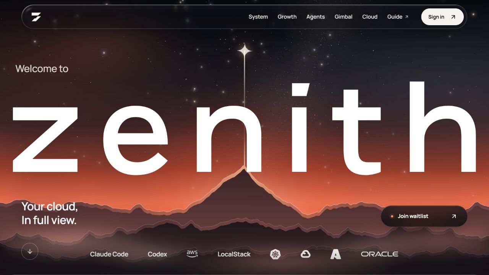
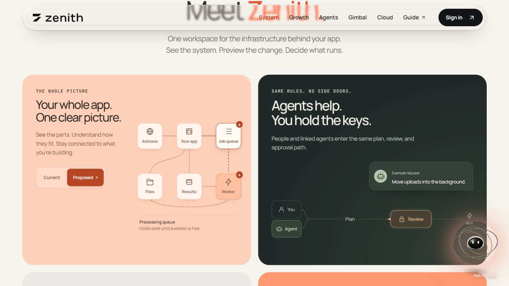
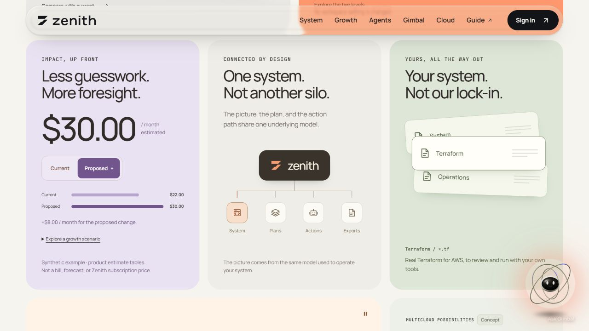
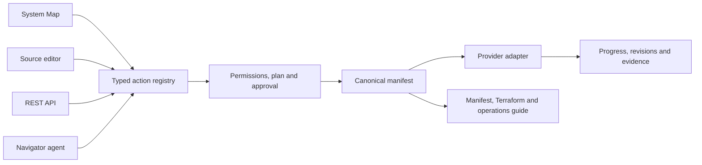

# Zenith

**Your cloud, in full view.**

A visual workspace for understanding the infrastructure behind your app, reviewing its next change, and keeping control of what runs.

[Explore Zenith](https://orrery-three-kappa.vercel.app) · [Read the guide](https://orrery-three-kappa.vercel.app/guide) · [Run locally](#quick-start) · [Architecture](docs/ARCHITECTURE.md)

[](https://orrery-three-kappa.vercel.app)

<sub>Captured from the live public site on 5 October 2026. The interactive examples use synthetic data; they are not connected to a cloud account.</sub>

## See the system. Review the change.

Zenith brings the **System Map**, editable **Source**, REST API and **Navigator agent** together around one typed manifest. Services, resources, routes and bindings describe the same system wherever you work.

- **Understand the whole stack.** See how your app, storage, queues and workers connect.
- **Plan before execution.** Inspect a change, its estimated cost and its risk before applying it.
- **Keep people and agents accountable.** Both use the same action registry, permissions, approval policies and audit trail.
- **Take the system with you.** Export the manifest, Terraform and an operations README.



<sub>The public tour illustrates current versus proposed infrastructure and the shared approval path. It does not provision resources.</sub>

## Understand the next move

The public tour makes infrastructure decisions tangible: compare a current and proposed system, explore autonomy levels, inspect an illustrative cost difference and see what leaves in an export bundle. Gimbal is the product’s visual companion and entry point to guidance.



<sub>Dollar amounts in this capture are synthetic examples from product estimate tables, not a bill, forecast or subscription price.</sub>

| Surface | What you can explore |
| --- | --- |
| **System Map + Inspector** | Topology, resource configuration, bindings and plan-first edits |
| **Source** | The working manifest, deployed revision and export bundle |
| **Deploys + Revisions** | Durable progress, deployment history and rollback points |
| **Observe + Security** | Provider-aware evidence, health, costs, drift and findings |
| **Navigator + Gimbal** | Goal planning, explicit autonomy, approvals and guided orientation |
| **Workspace** | Members, environments, connections, secret references and activity |

The hosted product screens require sign-in. For the complete local sandbox experience, use the quick start below. The [workspace reference](docs/WORKSPACE-TOUR.md) preserves the earlier application walkthrough separately from these current public-site screenshots.

## Quick start

Use **Node.js 22.16 or newer**. Docker is optional for the sandbox.

```bash
git clone https://github.com/GODOSTROYER/zenith.git
cd zenith
npm ci
npm run setup
npm run dev
```

Open **http://localhost:3400**.

Setup checks the local prerequisites, creates `.env.local` only when missing and seeds the Kepler Labs demo workspace when the data directory is empty. With no auth keys configured, the app runs in local demo mode with one local admin. Sandbox deployment and observability are simulated and labeled.

```bash
npm run doctor                 # Explain configuration and connection problems
npm run localstack:up           # Optional: real S3/SQS against local emulation
npm run build && npm start     # Production build, served locally
```

For environment variables, Docker, authentication and Vercel/Postgres deployment, follow **[Running Zenith](docs/RUNNING.md)**. Avoid running multiple writers against the same local data directory.

## Providers

| Provider | What works today | Boundary |
| --- | --- | --- |
| **Sandbox** | Plans, simulated deployments and generated observability | No cloud resource or container is created |
| **LocalStack** | Real S3 buckets and SQS queues against the local emulator | Other resource kinds remain labeled simulations |
| **AWS Preview** | Plans and Terraform/OpenTofu exports | No apply or AWS account discovery |
| **Kubernetes, Google Cloud, Azure** | Product roadmap | Not available as deployed providers |
| **Oracle Cloud** | Future direction | Not an available provider |

Managed hosting and multicloud placement shown on the public site are **in-development concepts**, not a currently operated hosting service. Cloud logos communicate the product direction; they do not override these availability boundaries.

## How it works


```mermaid
flowchart LR
  Map[System Map] --> Actions[Typed action registry]
  Source[Source editor] --> Actions
  API[REST API] --> Actions
  Agent[Navigator agent] --> Actions
  Actions --> Review[Permissions, plan and approval]
  Review --> Manifest[Canonical manifest]
  Manifest --> Provider[Provider adapter]
  Manifest --> Export[Manifest, Terraform and operations guide]
  Provider --> Evidence[Progress, revisions and evidence]
```

The action registry validates inputs, enforces roles and records outcomes. Deployment runs have durable state and streamed progress. The manifest carries secret references rather than secret values. Provider evidence and simulated outputs remain distinct in the UI.

The default local install uses a single-writer data directory; the serverless/Postgres path has separate configuration. Read the [architecture](docs/ARCHITECTURE.md), [contracts](docs/CONTRACTS.md) and [module map](docs/MODULE-MAP.md) for the implementation boundaries.

## Accounts and collaboration

- [Google authentication](docs/google-auth.md): sign-in, identity linking and password setup.
- [Workspace sharing](docs/workspace-sharing.md): email-bound invitations, roles and ownership transfers.
- [Waitlist operations](docs/waitlist.md): intake and batch access release.
- **Onboarding and Guide:** choose a workspace and connection, create an editable blueprint or import a file. Completing setup does not deploy anything.

## Configuration

Keep the complete environment table in one place: [docs/RUNNING.md](docs/RUNNING.md). Optional capabilities include Supabase authentication, language parsing for Navigator, encrypted secrets and the separately configured hosted subsystem.

The Postgres-backed hosted configuration and its migration requirements are documented in [HOSTED-POSTGRES.md](docs/HOSTED-POSTGRES.md). Do not point demonstration seeding commands at a project containing real users or data.

## Development

**Next.js · React · TypeScript · Tailwind CSS · Three.js**

| Command | Purpose |
| --- | --- |
| `npm run dev` | Start the development server on port 3400 |
| `npm run typecheck` | TypeScript checks |
| `npm run lint` | ESLint |
| `npm test` | Unit and component suites |
| `npm run verify` | Typecheck, lint, tests, smoke and Gimbal asset verification |
| `npm run build` | Production build |
| `npm run doctor` | Configuration diagnostics |
| `npm run screenshots` | Capture authenticated workspace screens against a running local server |

[CI results](https://github.com/GODOSTROYER/zenith/actions/workflows/ci.yml) are the source for build and test status. Use a disposable `ZENITH_DATA` directory for tests and smoke scripts. Fonts are self-hosted; normal rendering does not depend on Google Fonts requests.

### Screenshots

The three images at the top are real captures of the public site, dated **5 October 2026**, with no invented interface content. Their sources, framing and distinction from older workspace images are recorded in [screenshots/SOURCES.md](docs/screenshots/SOURCES.md).

`npm run screenshots` captures the authenticated workspace, not the landing-page gallery. Its configuration is documented in [scripts/screenshots.ts](scripts/screenshots.ts). Use a local production build and disposable demonstration data when refreshing those screens.

## Documentation

| Start here | What it covers |
| --- | --- |
| [Running](docs/RUNNING.md) | Installation, environment variables and troubleshooting |
| [Architecture](docs/ARCHITECTURE.md) | Data flow and architectural decisions |
| [Contracts](docs/CONTRACTS.md) | Action registry, API conventions and invariants |
| [Module map](docs/MODULE-MAP.md) | Where each part of the implementation belongs |
| [Design](docs/DESIGN.md) | Product language, interaction rules and visual system |
| [Limitations](docs/LIMITATIONS.md) | Implemented, partial and planned capabilities |
| [Technical debt](docs/DEBT.md) | Deliberate limits and upgrade paths |
| [Branding](docs/BRANDING.md) | Zenith identity and compatibility notes |

## Honesty

Zenith should never claim more than it can verify. Sandbox health and costs are simulated; AWS is plan/export Preview; LocalStack verification covers its supported subset. The local store requires one writer, and the hosted subsystem runs only where you configure and operate it.

Consult [LIMITATIONS.md](docs/LIMITATIONS.md) before relying on a provider, a verification result or a deployment mode. This repository currently has no license file.

---

Built by **[Arnav Bule](https://www.arnavbule.in)** · [GitHub](https://github.com/GODOSTROYER)
