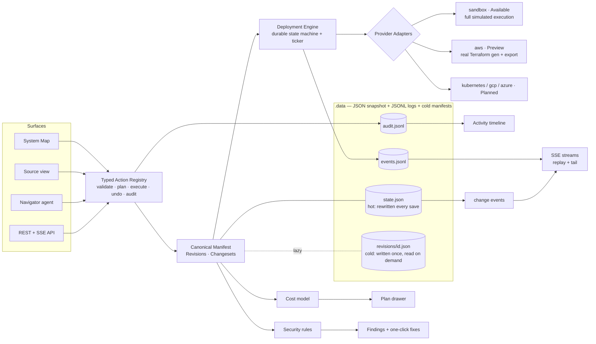

# Zenith — Architecture

**Thesis.** Zenith is a bring-your-own-cloud deployment and operations platform
for small SaaS teams. One canonical application manifest — a typed graph of
services, resources, routes, and explained bindings — is the single source of
truth for every surface: the living System Map, the Source view, the REST API,
and the Navigator agent. Every mutation flows through one typed action
registry (plan → cost/risk preview → execute → audit → undo), which is also
what makes trustworthy agentic control possible. Every deploy is a changeset
with a readable plan, a visible cost delta, streamed durable execution, an
unmistakable activation moment, and a rollback point. No lock-in: the manifest,
real Terraform, and an operations README export at any time.

Alongside it, and in the same process, sits the **hosted-apps subsystem**
(`src/lib/hosted`): private apps served on `<slug>.<ZENITH_APP_DOMAIN>` from a
pinned build, behind a grant list that is the only authority on who may open
them. It keeps its own store and is mapped below.

> One page for "where does this live and what may it import?" —
> [docs/MODULE-MAP.md](MODULE-MAP.md). This file is the prose behind it.



## Repository shape

`src/lib` is the server, listed below roughly in dependency order: the top of
the list is imported by almost everything and imports almost nothing, and the
bottom is the reverse. It is a gradient, not a strict layering — three pairs of
directories point at each other (`domain/graph` prices a diff with `cost`,
`providers/sandbox` uses `drift`'s expectation helper while `drift` takes only
`providers/types`, and `supabase/route` resolves a user through `auth/session`
while `auth` asks `supabase` whether it is configured). Every one of those
resolves cleanly at file granularity: **a static import cycle in `src/` is the
thing to avoid, and that is the invariant to preserve** — not a directory
hierarchy.

Three edges break it today, all of them the same shape — a `src/lib/hosted`
module carrying its own HTTP layer that reaches back into the request edge:
`hosted/access/http.ts` → `server/context`, `hosted/release/http.ts` →
`server/context`, and `hosted/release/http.ts` → `actions/core`. Neither
barrel re-exports its `http.ts`, so the fix is to move those two files out to
the server layer and nothing else moves. Two nearby edges are *not* cycles and
are fine: `actions/core.ts` → `hosted/config` (reading `hostedMode()`), and
`actions/defs/hosted.ts` → `hosted/config` + `server/context`. See
[docs/MODULE-MAP.md](MODULE-MAP.md), "Known violations".

One rule that does hold without exception: **`src/lib` and `src/components`
contain no imports from `@/app`.** Routes and screens depend on the library;
the library never depends on them.

```
src/lib/
  domain/       types.ts  graph.ts        the manifest, its zod schemas, id()/fnv1a()/hash32(),
                                          diffManifests. Pure. Imports nothing but zod.
  cost/         pricing.ts                estimate tables. Prices a manifest, never an account.
  format.ts                               fmtUsd / fmtDate / timeAgo / fmtDuration / cx. Presentation only.
  env.ts                                  every validated ZENITH_* variable, in one place.
  log.ts                                  one JSON object per line, request id via AsyncLocalStorage.
  data-lock.ts                            refuse a second process against one data directory.

  db/           types.ts                  the Store contract: Database, StoreChange, AuditFilter/Page.
                file-store.ts             the one implementation. state.json (hot) + JSONL logs +
                                          cold revision manifests.
                store.ts                  the façade. Picks an implementation (ZENITH_STORE) and
                                          re-exports it: db() / save() / q.* / onChange.
  secrets/      index.ts                  AES-256-GCM value store beside the snapshot. Never a route's business.
  drift/        index.ts                  pure: deployed manifest vs a provider's LiveState.
  security/     rules.ts                  findings derived from a manifest.
  logsim/       index.ts                  deterministic synthetic logs + health for sandbox envs.
  blueprints/   index.ts                  manifest factories.
  importers/    index.ts (barrel)         compose / dockerfile / terraform → manifest + ImportReport.
                types.ts                  shared vocabulary + the one slugify()/uniqueName().

  providers/    types.ts                  the adapter contract + registry (the documented import).
                sandbox/ localstack/ aws/ planned.ts    the four adapters.
  engine/       types.ts  engine.ts       durable deployment state machine + 250ms ticker.
  actions/      core.ts                   defineAction / runAction / roles / idempotency / audit.
                defs/ (barrel + 13)       the catalog. Importing a def registers it as a side effect.
  alerts/       index.ts channels.ts deliver.ts    rules, workspace channels, delivery with retry.
  navigator/    shared.ts                 client-safe vocabulary (the browser imports only this).
                planner.ts llm.ts run.ts server-actions.ts    deterministic planner + executor.

  auth/         session.ts                who is signed in. Identity only, never a permission.
  supabase/     env.ts client.ts server.ts route.ts middleware.ts admin.ts
                                          one entry point per Next context. Deliberately not barrelled.
  server/       boot.ts context.ts sse.ts route plumbing: ensureBoot, ApiError/route(), SSE.
  client/       api.ts alerts.ts secrets.ts hosted.ts   "use client" — the only way UI code
                                          talks to the API.

  hosted/       103 files, ~22% of src — the second product, in the same process.
                contracts/  (barrel)      types, zod schemas, error codes, host rules, the
                                          tracker and source contracts. Pure: no node:, no env,
                                          so the edge and the browser share it.
                config.ts                 every validated ZENITH_* variable, and appHostname().
                                          Secrets are presence-only, read at one call site each.
                digest.ts                 the one SHA-256 / treeDigest rule; identities cannot drift.
                edge.ts                   the host split run inside src/middleware.ts: an app host
                                          is rewritten to the gateway and never sees the platform
                                          session logic.
                authority/                the control authority — one control.sqlite, one
                                          connection, one tx() rule. Apps, grants, invitations,
                                          sessions, exchanges, jobs, releases, quotas, usage,
                                          revocations, backups and events live here and nowhere
                                          else. Commit before ACK; anything leaving the process
                                          is an outbox row in the same transaction.
                access/                   who may open an app: grants (the only authority), hashed
                                          single-use invitations, the 60s exchange code, the opaque
                                          app session, and the live getUser() check where a valid
                                          JWT is not enough.
                gateway/                  the app host's front door. Admission in contract order —
                                          host, app, state, quota, authority, reserved route,
                                          session, release — before a byte of artifact or a row of
                                          app data is touched.
                artifacts/                immutable, content-addressed build outputs, and the
                                          trusted re-hash a release must pass before it activates.
                source/                   the untrusted-input boundary: bounded tar reading, the
                                          supported-source contract, materialisation. Nothing
                                          submitted is executed or installed from.
                build/                    one pinned recipe, three boundaries (local child process,
                                          E2B, Docker). The only place a submission is compiled.
                release/                  apps, publish jobs, releases, rollback, suspension and the
                                          250ms job runner. A healthy app keeps serving until a
                                          candidate is built, stored, re-verified and probed.
                runtime/                  local (this process) and cloudflare (Workers for
                                          Platforms) behind one interface. ZENITH_CF_API_TOKEN is
                                          read on one line here and nowhere else in src/.
                data/                     the per-app customer data layer — the fixed broker's
                                          storage side, on SQLite or D1.
                quota/                    requests per app per UTC day, body limits, and the honest
                                          enforcement table. The count lives in SQLite, never in
                                          this process.
                usage/                    the usage ledger, the spending estimate, the 50/75/90%
                                          alerts and the build pause. Every dollar is an estimate
                                          and says so.
                events/                   activation and lifecycle events: subjects stored only as
                                          an HMAC, deduped per logical operation, and never able to
                                          break a request.
                health/                   real health and real logs for one app, attributed to the
                                          release that served them. Nothing here is simulated.
                backup/                   encrypted off-host backup and clean-host restore, with
                                          revocation reconciliation so a restore cannot re-admit
                                          somebody removed since the snapshot.
                export/                   the "you can leave" file: records and access *intent*,
                                          with everything it cannot carry named in `limitations`.
```

**The hosted subsystem has its own documentation set**, because it has its own
threat model, its own contracts and its own runbook:
[docs/hosted/](hosted/) holds `CONTRACTS-R3.md` (the control HTTP surface and
the app-host admission order), `THREAT-MODEL.md`, `DECISIONS.md` (the R3-\*
decisions this code cites by number), `DATA-LIFECYCLE.md`, `OPERATOR-ACCESS.md`,
`PROVIDERS.md`, `RUNBOOK-DEPLOY.md` and the acceptance evidence. Each hosted
subdirectory also carries a `README.md` giving one line per file. Start at
[src/lib/hosted/README.md](../src/lib/hosted/README.md).

**Barrels.** Only `actions/defs/` and `importers/` have one, because only they
have a single public surface. Three directories deliberately do **not**:
`supabase/` (a barrel would let a client component reach the service-role
admin client), `navigator/` (a barrel would pull `run.ts` → the store →
`node:fs` into the browser bundle, which is exactly what `shared.ts` exists to
prevent), and `providers/` (`providers/types` is already the documented spine
import; a barrel would make `@/lib/providers` ambiguous with it).

`tests/` mirrors `src/`: `tests/<dir>` covers `src/lib/<dir>`, plus
`tests/api` → `src/app/api`, and `tests/ui` / `tests/shell` / `tests/screens`
→ the matching `src/components` and app screens.

## Deployment pipeline

manifest (working copy) → `diffManifests` → **Changeset** (explanations, cost
delta, warnings) → `deploy.apply` action → policy check (approval? budget?) →
engine creates Deployment + provider `planSteps` → ticker executes steps
idempotently → events appended (replayable) → verify phase (honest health) →
`succeeded` + outputs (URL) → revision recorded → rollback point.

## Key decisions (ADRs)

1. **Embedded JSON/JSONL store** behind a repository module instead of SQLite:
   zero native-module risk on the local Windows toolchain; atomic snapshot
   writes + append-only logs give the durability the product needs at demo
   scale. *(Known ceiling: single process.)*

   **Swappable, and now literally so.** `src/lib/db/store.ts` is a *façade*:
   the contract lives in `src/lib/db/types.ts` (`Store`, `Database`,
   `StoreChange`, `AuditFilter`/`AuditPage`), the behaviour described in the
   rest of this decision lives in `src/lib/db/file-store.ts` as the single
   implementation `FileStore`, and the façade picks one — cached on
   `globalThis`, since the implementations keep process-wide state there — and
   re-exports it under the same names (`db`, `save`, `flush`, `flushPending`,
   `resetDb`, `appendEvent`/`readEvents`, `appendAudit`/`readAuditPage`/
   `readAudit`/`countAudit`, `onChange`/`changed`, `q.*`, `inWorkspace`). The
   ~113 modules that import `@/lib/db/store` are unchanged and cannot tell
   which implementation answers. `ZENITH_STORE` selects it: `file` (the
   default, and the only one this build ships) or `postgres`, which validates
   in `lib/env.ts` so the flag exists end to end and is refused by the façade
   with a sentence saying it is not available yet — the seam is real before
   the implementation is. `tests/db/contract/` is the table that keeps it
   honest: one ordered scenario — workspace → member → project → environment →
   revision (manifest reachable, accessor non-enumerable, absent from
   `JSON.stringify(db())`) → deployment → events → audit → `onChange` →
   `save`/`flush` → `reset` — run with `describe.each` over a factory list
   that has one row today and takes a second without a line changing here.
   Every method in `Store` is synchronous, because every method in `FileStore`
   is; where Postgres will need a promise the interface says so in a comment
   rather than churning the call sites for an implementation that does not
   exist.

   **Hot and cold.** `state.json` is rewritten in full on every save, so only
   what changes belongs in it. Revision manifests — immutable once written, and
   the largest thing the store holds — live one atomic file each under
   `<ZENITH_DATA>/revisions/<id>.json`, read on demand behind a 32-entry LRU.
   `Revision.manifest` is a **non-enumerable lazy accessor**: every reader
   (`revision.manifest`, in the engine, the providers, the alert and log
   simulators, the security rules, the server-rendered screens) keeps working
   untouched, while `JSON.stringify(db())` never sees a manifest. The one
   consequence for callers is that a `Revision` no longer carries its manifest
   through serialisation, so a route that puts one in a response body attaches
   it explicitly — `q.revisionManifest(id)`; `GET /api/revisions/:id` is the
   only one that does. A pre-split snapshot migrates on first load: side files
   are written *before* `state.json` is rewritten, so an interrupted migration
   simply re-runs.

   Measured with `ZENITH_DATA=<scratch> npx tsx tests/db/bench-manifests.ts <seeded dir>`
   (medians; Windows, 500 serialise samples and 50 whole-save samples):

   | store | bytes serialised / save | serialise | whole save |
   |---|---|---|---|
   | seeded demo, 3 revisions | 14,065 → **9,717** (−31%) | 0.048 → 0.045 ms | 1.13 → 1.36 ms |
   | synthetic, 500 revisions | 1,158,416 → **110,416** (−90%) | 7.27 → 1.09 ms (−85%) | 20.7 → 5.4 ms (−74%) |

   Read the demo row honestly: at three revisions the win is bytes, and
   wall-clock is a wash — a save is a `writeFileSync` plus a `rename` either
   way, and that pair costs more than the serialisation it wraps. The 500-row
   is the one that matters, because the engine saves on **every step
   transition**: the old shape re-serialised a megabyte of deploy history per
   step, forever. Revision *metadata* still grows linearly with deploys, which
   is what the paged `GET /api/projects/:id/revisions` route is for.
2. **Sandbox provider is a first-class citizen**, not a mock: same adapter
   contract as AWS, realistic phased execution, honest labeling. This keeps
   every demo path production-shaped.
3. **AWS ships as Preview = plan + real Terraform export, no apply** until
   credentials exist. Never fake a cloud call.
4. **Actions-first architecture**: agentic control is a consumer of the same
   registry as buttons. The agent ships last but is designed first.
5. **Computed semantic layout** on the System Map: layout derives from the
   graph (Edge → Services → Data strata). Users don't freely drag nodes into
   positions that imply false topology — the category audit showed exactly
   how that lies.
6. **Deterministic Navigator planner v1**; LLM enhancement only when a key is
   present, clearly labeled. No fake AI.
7. **The project payload is pushed, not polled.** Every successful save emits
   an in-process change event naming the projects it touched (`onChange`;
   empty means "unknown, assume any", because one coalesced write can carry
   several callers' mutations). `GET /api/projects/:id/stream` subscribes and
   re-sends the payload — the same body and the same hash as the GET — when
   and only when that hash moves. Nothing is recomputed on a quiet connection.
   The screens keep the 5s poll behind it and fall back to it whenever the
   stream is not *delivering*: no `EventSource`, a connection that errored, or
   one that opened and never spoke (a buffering proxy). Same single-process
   ceiling as the store — an `EventEmitter` on `globalThis` is not a message
   bus, and a second process would see none of it.
