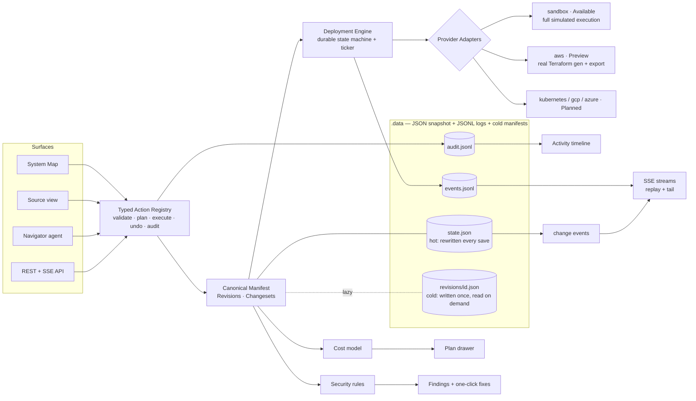

# Orrery — Architecture

**Thesis.** Orrery is a bring-your-own-cloud deployment and operations platform
for small SaaS teams. One canonical application manifest — a typed graph of
services, resources, routes, and explained bindings — is the single source of
truth for every surface: the living System Map, the Source view, the REST API,
and the Navigator agent. Every mutation flows through one typed action
registry (plan → cost/risk preview → execute → audit → undo), which is also
what makes trustworthy agentic control possible. Every deploy is a changeset
with a readable plan, a visible cost delta, streamed durable execution, an
unmistakable activation moment, and a rollback point. No lock-in: the manifest,
real Terraform, and an operations README export at any time.

## Deployment pipeline

manifest (working copy) → `diffManifests` → **Changeset** (explanations, cost
delta, warnings) → `deploy.apply` action → policy check (approval? budget?) →
engine creates Deployment + provider `planSteps` → ticker executes steps
idempotently → events appended (replayable) → verify phase (honest health) →
`succeeded` + outputs (URL) → revision recorded → rollback point.

## Key decisions (ADRs)

1. **Embedded JSON/JSONL store** behind a repository module instead of SQLite:
   zero native-module risk on the local Windows toolchain; atomic snapshot
   writes + append-only logs give the durability the product needs at demo
   scale. Swappable behind `src/lib/db/store.ts`. *(Known ceiling: single
   process.)*

   **Hot and cold.** `state.json` is rewritten in full on every save, so only
   what changes belongs in it. Revision manifests — immutable once written, and
   the largest thing the store holds — live one atomic file each under
   `<ORRERY_DATA>/revisions/<id>.json`, read on demand behind a 32-entry LRU.
   `Revision.manifest` is a **non-enumerable lazy accessor**: every reader
   (`revision.manifest`, in the engine, the providers, the alert and log
   simulators, the security rules, the server-rendered screens) keeps working
   untouched, while `JSON.stringify(db())` never sees a manifest. The one
   consequence for callers is that a `Revision` no longer carries its manifest
   through serialisation, so a route that puts one in a response body attaches
   it explicitly — `q.revisionManifest(id)`; `GET /api/revisions/:id` is the
   only one that does. A pre-split snapshot migrates on first load: side files
   are written *before* `state.json` is rewritten, so an interrupted migration
   simply re-runs.

   Measured with `ORRERY_DATA=<scratch> npx tsx tests/db/bench-manifests.ts <seeded dir>`
   (medians; Windows, 500 serialise samples and 50 whole-save samples):

   | store | bytes serialised / save | serialise | whole save |
   |---|---|---|---|
   | seeded demo, 3 revisions | 14,065 → **9,717** (−31%) | 0.048 → 0.045 ms | 1.13 → 1.36 ms |
   | synthetic, 500 revisions | 1,158,416 → **110,416** (−90%) | 7.27 → 1.09 ms (−85%) | 20.7 → 5.4 ms (−74%) |

   Read the demo row honestly: at three revisions the win is bytes, and
   wall-clock is a wash — a save is a `writeFileSync` plus a `rename` either
   way, and that pair costs more than the serialisation it wraps. The 500-row
   is the one that matters, because the engine saves on **every step
   transition**: the old shape re-serialised a megabyte of deploy history per
   step, forever. Revision *metadata* still grows linearly with deploys, which
   is what the paged `GET /api/projects/:id/revisions` route is for.
2. **Sandbox provider is a first-class citizen**, not a mock: same adapter
   contract as AWS, realistic phased execution, honest labeling. This keeps
   every demo path production-shaped.
3. **AWS ships as Preview = plan + real Terraform export, no apply** until
   credentials exist. Never fake a cloud call.
4. **Actions-first architecture**: agentic control is a consumer of the same
   registry as buttons. The agent ships last but is designed first.
5. **Computed semantic layout** on the System Map: layout derives from the
   graph (Edge → Services → Data strata). Users don't freely drag nodes into
   positions that imply false topology — the category audit showed exactly
   how that lies.
6. **Deterministic Navigator planner v1**; LLM enhancement only when a key is
   present, clearly labeled. No fake AI.
7. **The project payload is pushed, not polled.** Every successful save emits
   an in-process change event naming the projects it touched (`onChange`;
   empty means "unknown, assume any", because one coalesced write can carry
   several callers' mutations). `GET /api/projects/:id/stream` subscribes and
   re-sends the payload — the same body and the same hash as the GET — when
   and only when that hash moves. Nothing is recomputed on a quiet connection.
   The screens keep the 5s poll behind it and fall back to it whenever the
   stream is not *delivering*: no `EventSource`, a connection that errored, or
   one that opened and never spoke (a buffering proxy). Same single-process
   ceiling as the store — an `EventEmitter` on `globalThis` is not a message
   bus, and a second process would see none of it.
