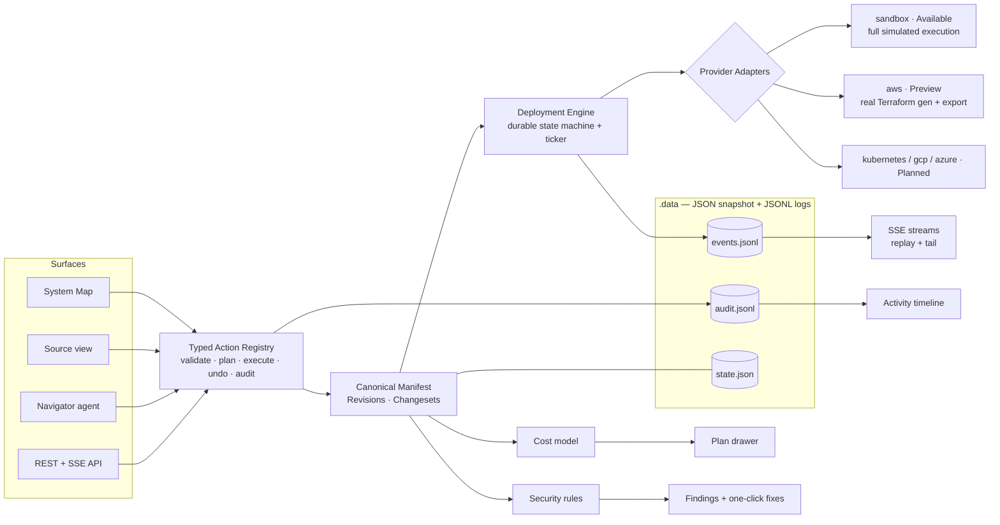

# Orrery — Architecture

**Thesis.** Orrery is a bring-your-own-cloud deployment and operations platform
for small SaaS teams. One canonical application manifest — a typed graph of
services, resources, routes, and explained bindings — is the single source of
truth for every surface: the living System Map, the Source view, the REST API,
and the Navigator agent. Every mutation flows through one typed action
registry (plan → cost/risk preview → execute → audit → undo), which is also
what makes trustworthy agentic control possible. Every deploy is a changeset
with a readable plan, a visible cost delta, streamed durable execution, an
unmistakable activation moment, and a rollback point. No lock-in: the manifest,
real Terraform, and an operations README export at any time.

## Deployment pipeline

manifest (working copy) → `diffManifests` → **Changeset** (explanations, cost
delta, warnings) → `deploy.apply` action → policy check (approval? budget?) →
engine creates Deployment + provider `planSteps` → ticker executes steps
idempotently → events appended (replayable) → verify phase (honest health) →
`succeeded` + outputs (URL) → revision recorded → rollback point.

## Key decisions (ADRs)

1. **Embedded JSON/JSONL store** behind a repository module instead of SQLite:
   zero native-module risk on the local Windows toolchain; atomic snapshot
   writes + append-only logs give the durability the product needs at demo
   scale. Swappable behind `src/lib/db/store.ts`. *(Known ceiling: single
   process.)*
2. **Sandbox provider is a first-class citizen**, not a mock: same adapter
   contract as AWS, realistic phased execution, honest labeling. This keeps
   every demo path production-shaped.
3. **AWS ships as Preview = plan + real Terraform export, no apply** until
   credentials exist. Never fake a cloud call.
4. **Actions-first architecture**: agentic control is a consumer of the same
   registry as buttons. The agent ships last but is designed first.
5. **Computed semantic layout** on the System Map: layout derives from the
   graph (Edge → Services → Data strata). Users don't freely drag nodes into
   positions that imply false topology — the category audit showed exactly
   how that lies.
6. **Deterministic Navigator planner v1**; LLM enhancement only when a key is
   present, clearly labeled. No fake AI.
