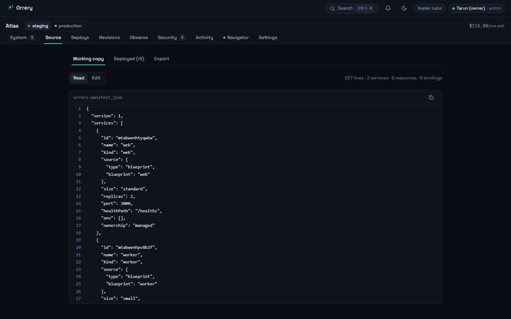
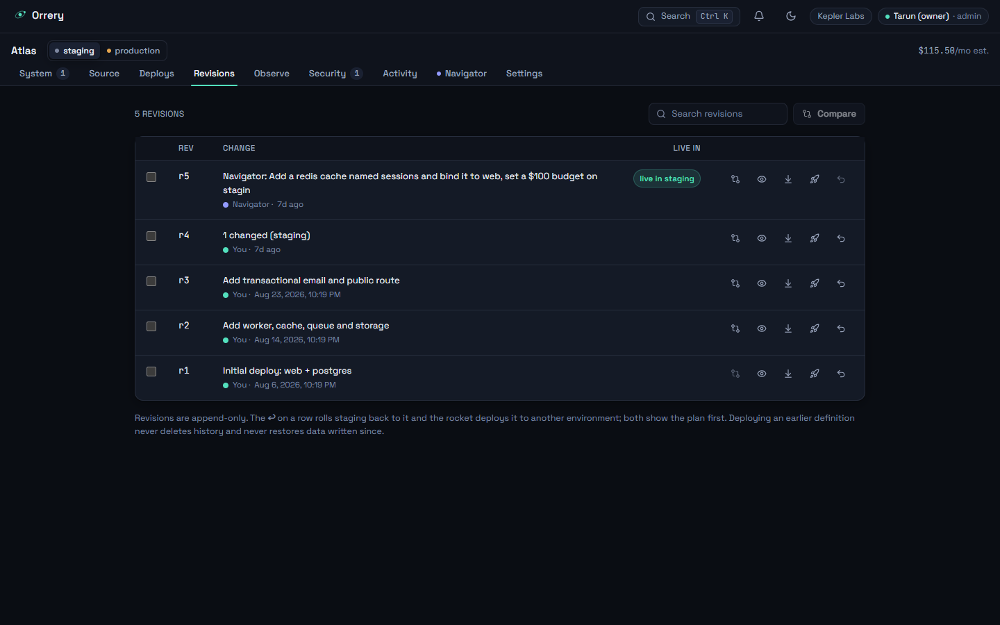
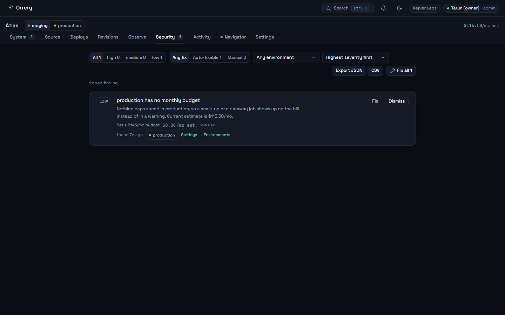

# Workspace tour

This reference preserves the earlier authenticated workspace tour. Its screenshots document the earlier application interface; the current public-site captures are in the [project README](../README.md). Refer to [RUNNING.md](RUNNING.md) and [LIMITATIONS.md](LIMITATIONS.md) for current setup and provider behavior.

### Overview — `/overview`

The workspace home. Each project card carries two numbers Zenith refuses to
conflate — what the working copy would cost and what the deployed revision costs
— plus waiting changes, open findings, and a chip per environment showing its
live revision and pending count. The budget meter turns red when the projection
passes the cap, not after the bill arrives.

### System Map — `/p/<project>`

The centerpiece, and the clearest expression of **a map that cannot lie**:
layout is computed from the graph into three strata — Routes, Services,
Resources, left to right — so nobody can drag a node into a position implying a
topology the manifest does not have. Nodes show status, kind, size and their own
monthly estimate; edges are bindings labelled with the capability they grant.
Undeployed changes render ghosted and dashed (the `new` badge on `res1`), and a
persistent pill counts them with their cost delta and opens the Changes drawer —
the plan-first law made visible: no path from an edit to a deploy skips review.

### Inspector — the right drawer on the map

Selecting a node opens the inspector: config, environment variables and secret
references, the bindings it participates in, and the operations available on it.
Every field explains itself in one line, every cost-bearing field prices itself
as you type (`$28.00/mo est.`), and no edit applies on blur — it becomes a
pending change with a plan behind it. Controls above the caller's role are
disabled with the reason, never hidden.

### Source — `/p/<project>/source`

The same manifest the map draws, as JSON you can read, edit and validate.
Working copy and deployed revision sit side by side as tabs, and Export produces
the bundle — manifest, real Terraform, operations README. Saving goes through
`project.updateManifest` like every other mutation, so hand-editing the JSON is
not a back door around plans or the audit trail.

### Deploys — `/p/<project>/deploys`

Every deployment, in flight or finished, with the actor that started it —
including the Navigator. The detail pane is the durable state machine rendered:
four phases, every step with its real duration, a "What changed" link back to the
changeset. Progress streams over SSE and replays from a sequence number, so a
refresh mid-deploy resumes rather than restarts. A failed step marks the rest
skipped and offers rollback — disabled, with the reason, on a first deployment.

### Revisions — `/p/<project>/revisions`

Every deployed definition, append-only, with any two comparable. Each row can be
compared with the one before it, viewed as JSON, loaded into the working copy,
promoted to another environment, or rolled back to — and the last two show the
plan first. The footer is the honesty law in one sentence: deploying an earlier
definition never deletes history and **never restores data written since**.

### Observe — `/p/<project>/observe`

Health, drift, application logs, cost and alerts for one environment, stacked as
cards. Health reads the same inputs the alert evaluator does, so a health card
and an alert can never disagree. Drift compares the deployed revision against
what the provider's `observe()` actually finds — real against LocalStack, seeded
and labeled against the sandbox, a refusal against AWS Preview, which names
`terraform plan` as the honest way to see drift today. Note how many `simulated`,
`synthetic` and `estimate` chips this one screen carries: that is the point.

### Security — `/p/<project>/security`

Findings derived from the manifest, filterable by severity, environment and
whether a one-click fix exists. A fix is not a special code path — it is a
registered action with its own plan, cost and risk, which is why the row can
state `$0.00/mo est.` and `low risk` before you press it, and why a fix that
would be refused is never offered. Findings can be resolved, dismissed with a
reason, or reopened.

### Activity — `/p/<project>/activity`

The audit trail: one row per action, human and agent in the same list, each with
its action id, actor, recorded input and result. The header says exactly how much
of the trail is loaded rather than implying it is everything, and separates the
filters that query the whole log from the search that only reads what is loaded.
A Navigator step and a click are indistinguishable here except for the actor —
the property that makes the agent safe to run at all.

### Navigator — `/p/<project>/navigator`

State a goal in plain language; the Navigator turns it into a list of registered
actions with rationale, risk and cost, and executes them under an autonomy dial
with five levels — observe, plan, approve, bounded, autonomous. The chip reads
`deterministic planner` because that is what runs without `ANTHROPIC_API_KEY`;
with a key it reads `language parsing · <model>`, and each run still says which
half read the goal. Steps obey each environment's approval policy, land in the
audit trail, and a run whose steps outrank the person who pressed Run is refused.
Nothing here can do anything you could not do yourself from the map.

Gimbal is the Navigator's quiet visual companion: a simplified face at the
center of three gyroscope rings. A surrounding glow communicates planning
(purple), awaiting approval (yellow), applying (blue), verified (green), or
blocked (red), alongside a plain-text status. The rings explore while planning,
hold a concentric alignment for approval, coordinate while applying, and adopt
an interrupted pose when blocked. Transitions preserve their orientation.
Hover and tap add a glance or greeting, including in the SVG fallback.
The procedural renderer pauses offscreen, respects reduced motion, and caps
rendering at 30fps (20fps in low-power mode). Motion settings retain the canvas;
a GPU failure gets one retry before keeping the functional fallback. Visit
[`/gimbal`](http://localhost:3400/gimbal) for the interactive preview.

Green requires recorded, fresh provider evidence, not merely successful actions.
Whole-run verification currently covers deployment-only workflows (optionally
with planning/investigation) targeting LocalStack's managed S3/SQS subset with
default configuration and no services, routes, or bindings. Read-only checks
confirm intended resource presence and removals, and remain available in run
history. Sandbox simulations and unsupported or incomplete checks stay neutral;
failed provider checks show blocked. This verifies local emulation, not real AWS.

### Settings — `/p/<project>/settings`

Eight sections on one scrolling page. **Workspace** renames through a plan like
anything else, and says the slug will not change so links keep working.
**Members** shows who is in the workspace, what each role may do, and how invites
and operator-set Supabase role claims interact. **Environments** covers rename,
clone, region, budgets and approval policies; **Connections** lists the exact
permissions each one holds; **Secrets** is the reference-only view of the
encrypted store; **Alerts** holds the workspace's webhook, Slack and email
delivery channels (the rules that use them live on Observe); **Export** is the
take-it-and-leave bundle. The **Danger zone** deletes the project — admin only,
typed-name confirmation, a plan listing the exact counts that go, a plain
statement that nothing in your cloud is torn down, and a refusal while a
deployment is in flight.
