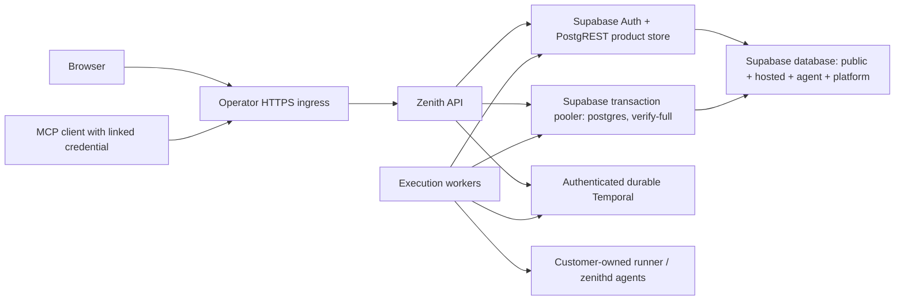

# Supported installation preparation

The supported topology uses real Supabase product storage and browser authentication,
its **platform schema in the same Supabase database**, authenticated durable Temporal, the
Zenith API and execution workers, and customer-owned agents. Preparation is available;
a complete live production installation has not been demonstrated. Configuration
validation does not establish authenticated sign-in, TLS connectivity, concurrent
operation, recovery, or successful execution.



The committed `deploy/self-hosted/compose.yml` runs the API and execution worker.
Its `maintenance` profile runs the existing platform migrator explicitly. Managed
Supabase, Temporal Cloud or an
operator-managed highly available authenticated Temporal cluster, and HTTPS ingress
are external prerequisites. There is no shared JSON product store or shared PGlite
database between API and workers. API and worker scratch/cache mounts are separate;
product, hosted/agent and platform records share one database authority.

For a disposable engine fixture, add `compose.disposable.yml`. It supplies only
Temporal CLI 1.9.1's development server with a project-owned volume. All database
schemas and real Auth/PostgREST use one isolated Supabase project. The default
local harness starts this project through the Supabase CLI, adds private-CA HTTPS
and pooler TLS, and builds native images into an owned localhost registry. Its
lean profile runs one API and one worker; the default runs two of each. See
[PKG-04's exact commands](../build/production/verify/PKG-04.md). Temporal's
SQLite development server does not establish production HA or recovery. The root
`docker-compose.yml` remains a separate LocalStack development fixture.

## Prerequisites

- Docker Compose 2.30+ (raw private `env_file` support), an available loopback API
  port, and immutable API, worker and migration image references. Registry digests
  must be recorded after a clean locked build; a digest in configuration is not
  evidence that the image was built or has compatible public auth values.
- A real Supabase project with operator-reviewed committed `supabase/migrations`
  applied in order, existing roles and Auth signup hooks intact, and correct Auth
  redirect/site URLs. Do not use the CI disposable role bootstrap on this project.
  Expose only the intended product API schemas; never expose `platform`, `agent`
  or private authority tables through PostgREST. Confirm service-role isolation.
- `SUPABASE_DB_URL` is the transaction pooler URI on port 6543 with
  `sslmode=verify-full`; the existing driver disables named prepared statements.
  A direct PostgreSQL URI does not replace Supabase Auth/PostgREST.
- Runtime connects as PostgreSQL role `postgres` through the Supabase transaction
  pooler. The installer generates `ZENITH_PLATFORM_DB_URL` exactly equal to
  `SUPABASE_DB_URL`; supplying a different string refuses preparation. The native
  MCP predicate checks opened connection provenance, the actual role and current
  product authority before the permanent start CAS. Separate servers and alternate
  runtime roles are unsupported. Never expose `platform` or `agent` via PostgREST;
  anon/authenticated must have no schema USAGE and every platform table must have RLS.
- `ZENITH_PLATFORM_MIGRATION_URL` targets the same Supabase project and database
  `postgres`, on port 5432 with `sslmode=verify-full`: direct
  `db.<ref>.supabase.co` as `postgres`, or a `*.pooler.supabase.com` session
  endpoint as `postgres.<ref>`. It may use a separately supplied credential but
  cannot select another project, database or role. Disposable preparation derives
  `supabase-db:5432/postgres` as `postgres` from the CLI credentials; only this
  private network's direct connection is non-TLS. Runtime still requires pooler TLS.
- Production Temporal requires an existing explicit namespace, address and TLS
  API key. This preparation package implements the API-key form. A self-managed
  cluster requiring mTLS needs an operator-reviewed certificate mount extension;
  it must not disable authentication or TLS. Use the server's supported durable
  persistence/visibility databases, replicas across failure domains, backups and
  namespace retention. CLI `start-dev` proves none of those properties.
- The HTTPS ingress must preserve the configured `Host` and enforce TLS. Agent
  origin checks do not trust forwarded-host headers. The API publishes only on
  loopback; no PostgreSQL or Temporal ports are published.

## Build and prepare, without startup

Build only after an approved build resource slot. Use a clean committed checkout,
the lockfile, and the exact image recipes; do not copy a warm `.next` or `node_modules`.
The API's `NEXT_PUBLIC_SUPABASE_URL`, `NEXT_PUBLIC_SUPABASE_PUBLISHABLE_KEY`, optional
`NEXT_PUBLIC_SUPABASE_OAUTH_PROVIDERS`, and `NEXT_PUBLIC_SITE_URL` must be supplied as
**Docker build arguments** matching the private input. Next.js embeds them in the
browser bundle; runtime variables alone do not configure authentication. Never pass
the service-role key as a build argument. The worker recipe is
`docker/worker.Dockerfile`; the migration recipe is
`deploy/self-hosted/migrations.Dockerfile`, with repository root as build context.
Record each resulting image digest and architecture. The Node API/migration base
is pinned to 22.23.3 Alpine; the worker uses its existing pinned Debian Node image.

Copy `deploy/self-hosted/production.input.example.json` to a private **outside-repository**
file, make it mode 0600, and replace every placeholder with actual inputs. For
`mode: "disposable"`, use the exact loopback origin `http://127.0.0.1:36400`,
`https://supabase.localhost:54321`, the local verified-TLS transaction pooler,
and image digests. Omit platform URLs and Temporal input fields; preparation
binds platform to the product URL and derives the local direct migrator and Temporal.
The supported private configuration format is schemaVersion 2. Version 1 directories
refuse with `schema-v1-reprepare-required-no-data-copy`. Clean up their owned
resources and prepare a fresh directory; this helper does not copy or migrate data.

```sh
node scripts/deploy/installation.mjs prepare "$HOME/.zenith/installations/review" "$HOME/.zenith/install-input.json"
node scripts/deploy/installation.mjs preflight "$HOME/.zenith/installations/review"
node scripts/deploy/installation.mjs compose-check "$HOME/.zenith/installations/review"
```

The target directory must not already exist; choose an ASCII path without spaces
or shell metacharacters. Preparation creates mode 0700
directories and mode 0600 files, a random project/ownership ID, a 32-byte secret,
Ed25519 control and RSA OIDC private signing keys. Credentials are runtime inputs,
never committed fixtures. Back up these keys securely: losing them prevents
decryption and invalidates grants. Rotation and restore require a reviewed runbook.
Container runtime environment is visible to Docker administrators; protect host
access and use an appropriate secrets manager for a production operator workflow.

`installation.json` and the raw `.env` files contain secrets; never print/upload them
or run plain `docker compose config`. The helper runs `config --quiet` and suppresses
expanded provider diagnostics. It verifies actual env files match the validated
configuration. Ambient shell variables do not select a store or replace credentials.
The helper also removes shell overrides of its six validated Compose interpolation
settings. Before invoking Compose directly, unset `ZENITH_INSTALLATION_ID`,
`ZENITH_PRIVATE_DIR`, `ZENITH_API_PORT`, `ZENITH_API_IMAGE`, `ZENITH_WORKER_IMAGE` and
`ZENITH_MIGRATION_IMAGE` in the invoking shell. The safe `plan.json` describes images, project ID, limits, ports, volumes and pending
acceptance. Source binding hashes tracked and untracked nonignored source contents;
it identifies the preparation checkout, not the provenance of an arbitrary image.

## Review the footprint before startup

Production API + worker have a combined ceiling of 4 CPUs / 5 GiB; the disposable
Temporal fixture adds 1 CPU / 1 GiB. The migration profile adds 1 CPU /
1 GiB while invoked. These are preparation limits, not measured sizing. API port
binding is `127.0.0.1:<apiPort>`, with no engine ingress. Worker readiness is loopback
port 9464 inside its container. All services, networks and named volumes carry the
generated installation ownership label and project prefix; there are no fixed
container names or external/shared volumes. Workers use `/var/lib/zenith` and `/tmp`
as writable paths; the API uses durable `/data` plus bounded UID/GID 1001 tmpfs
mounts for `.next/cache` and `/tmp`. The primary preparation supports one worker. Attach extra workers with
`prepare --join <parent/keyring.json> <new-private-directory>`; the canonical
keyring and effective env must match exactly. Each joined worker has its own
scratch volume and identical custody/signing keys. Do not use Compose `--scale`
with a shared scratch volume, or a fresh unrelated keyring. The default harness
prepares its second worker through this join. Concurrent execution acceptance remains pending.

The installation preparer does not start services or delete resources. The explicitly
gated default-stack harness starts and cleans its owned disposable installation. Starting the Zenith API still
requires the explicit narrow user approval after review of `plan.json`, private
preflight, image compatibility, ports and resource limits. Existing authorization
for isolated workers/PostgreSQL/Temporal does not authorize the API or LocalStack.
After approval, the operator uses `composeArgs()`'s project, private env-file and
compose-file arguments, starts only the required engines, runs
`--profile maintenance run --rm platform-migrate`, checks the actual migration
ledger, and then starts API + worker. Production migrations must precede these
processes; neither process creates platform tables. Repeated migration invocation
uses the shipped migrator's checksum and transaction locking checks.

Stop/cleanup must use that exact generated project and inspect its ownership
labels first. Never run global prune, delete a supplied Supabase project, or remove
unrelated volumes. Production database/Temporal backups are outside Compose cleanup.
Destroying disposable project volumes deliberately destroys its engine fixture data.

## Readiness and customer agent acceptance

After approved startup, `node scripts/deploy/installation.mjs readiness <private-dir>`
performs bounded read-only HTTP checks through the configured origin: `/api/me`
must report configured auth; `/login` must serve HTML; MCP v3 must reject an absent
bearer with its discovery challenge. If trusted `ZENITH_AGENT_OAUTH_ISSUER` and
`ZENITH_AGENT_OAUTH_JWKS` are explicitly supplied, metadata must name that issuer
and the v3 resource. Without them metadata is recorded as `not-configured`; the
package does not advertise OAuth interoperability. Supabase browser Auth alone
does not establish an OAuth server issuing the MCP resource audience. Real browser
consent can create a scoped linked credential in the durable agent authority.

HTTP readiness is not interactive browser sign-in, authenticated MCP discovery,
database health, worker polling or execution proof. Collect those independently,
using a real user/tenant, grant/revocation and customer-owned target. Do not inject
test ports, accept demo authentication, or treat skipped external acceptance as pass.

Install customer agents in the customer's trust boundary using the committed
[`zenithd` recipe](../../deploy/zenithd/INSTALL.md) or
[`runner Helm chart values`](../../deploy/helm/zenith-runner/values.yaml). Build and pin the
appropriate customer agent image, create a short-lived registration token through
real authorized browser consent, and use a private token file/Secret. Never ship a
default registration token or fabricate an agent identity. Retain its durable
identity volume; enable only explicitly authorized capabilities/targets. Cloud
purchases, customer registration, provider actions and live TLS fixtures require
their existing external authorization.

Release acceptance still requires clean image builds (including both required
architectures), real Supabase schema/auth and pooler TLS, one shared database authority,
authenticated Temporal polling, worker readiness, browser sign-in, linked MCP
authorization/revocation, concurrent API/workers, a real customer agent execution,
and backup/restore and interrupted-execution recovery. `plan.json` and readiness
receipts keep `productionReady: false` until that independently observed program
has been completed; they never mark unobserved acceptance passed.


## Original-plan custody
Preparation generates an independent `ZENITH_PLAN_ARTIFACT_KEY` in private
configuration and supplies it only to `worker.env`, separately from vault/Temporal
keys. Cooperating workers must share that artifact keyring. Back it up independently
of PostgreSQL; without matching keys, retained originals cannot be authenticated.

Drain existing local-plan workers, apply canonical platform migration 7, and install
the checksum-verified worker image before polling. Startup requires PostgreSQL,
current schema, usable dedicated artifact keys and matching packaged executable
identity. Pending approvals with no authenticated original need new review; neither
legacy files nor newly generated plans can substitute for the reviewed original.

Worker scratch directories remain private and independent. Original ciphertext is
retained in PostgreSQL, so loss of the producing worker directory is recoverable when
source/backend/lock/executable and key context still match. A destroy source review
associates the original with its exact immutable destination before any human decision.
Destination execution requires its own claim, browser human approval and successful
source completion. Dispatch is durable and single-use; a lost reply requires inspection
because provider effects may already have occurred. Fences cannot undo accepted calls.

Maintenance performs logical expiry only, retaining ciphertext and all historical local
files. No backup pruning, physical artifact purge, key retirement, immutable re-encryption
or cross-platform portability policy is introduced. Previous artifact keys are private
`ZENITH_PLAN_ARTIFACT_PREVIOUS_KEYS` JSON values and are decrypt-only; test restore with
the matching keyring and backend context before relying on recovery.
