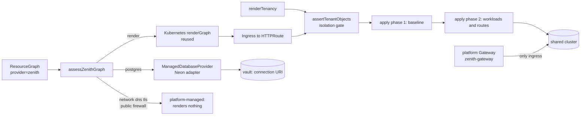

# Zenith-managed hosting (`provider = zenith`)

Code: `src/lib/providers/zenith/**`. Cluster baseline: `deploy/zenith-managed/`.
Tests: `tests/providers/zenith/**`.

## Honest status

**Nobody operates a hosted Zenith cluster today.** There is no cluster, no
gateway, no registry, no object store and no managed-database account behind
this code. What exists:

- the provider as code: tenant isolation rendering and validation, the
  substrate configuration, a managed-database port with one adapter, the
  drivers, an apply pipeline, and an export bundle;
- tests against doubles: a recording fake of the Kubernetes provider's
  toolkit and a local HTTP server shaped from Neon's public OpenAPI document;
- placeholder cluster manifests that have never been applied.

Every driver declares `contract` evidence at best. Nothing here has been
exercised against a real Kubernetes API server, a real CNI, a real gateway or a
real Neon account. The sections below say, per feature, what that leaves
unverified. "Implemented" in this document means "the code exists and its
contract tests pass", never "it has served a tenant".

## The decision

Fully managed hosting is **another provider**, not a fork of the product
architecture. A managed environment is the same portable resource graph
(ADR-0003), realized through the same driver contract (ADR-0004) and the same
Kubernetes server-side-apply ownership rules (ADR-0015) as any Kubernetes
cluster. The contract table already says so: the `zenith` row of
`src/lib/resources/native-types.ts` equals the Kubernetes row.

What the provider adds is a **tenancy layer** that makes one shared cluster safe
to hand to many workspaces, plus a **substrate** (the platform's own domain,
gateway, registry, storage and database provider), plus honest refusals for
everything the managed platform does not offer.

Two hard decisions, both about not taking on risk disproportionate to a
stage where nobody runs the cluster yet:

1. **No Postgres fleet.** `postgres` on `zenith` is always a managed database
   service behind the `ManagedDatabaseProvider` port, never an in-cluster
   StatefulSet. Running other people's stateful databases (backups, failover,
   upgrades, data-loss liability) is the wrong thing to build first. The
   isolation gate refuses a StatefulSet outright. One adapter exists (Neon);
   another provider is another implementation of the port.
2. **Reuse, do not copy, the Kubernetes provider.** The renderers, server-side
   apply, read and list, and the Kubernetes drivers are the Kubernetes
   provider's. This module codes against a thin adapter (`k8s-port.ts`) and wraps
   the drivers.

## Architecture

`applyZenithEnvironment` runs: render (pure) → ensure managed databases → apply
the tenancy baseline → apply workloads and routes. It stops at the first phase
that does not fully succeed and reports which (`blockedBy`). Each apply phase is
the Kubernetes provider's all-or-nothing preflight, so an ownership conflict
refuses that phase whole.

## Isolation model

One namespace per **environment**, named from the ids:
`zt-<workspace>-<env>-<hash10>` (DNS-1123, at most 51 characters). The 10-hex
suffix is a SHA-256 over the NUL-separated full ids, so two tenants never share
a namespace even when their readable parts truncate alike. The `zt-` prefix keeps
it disjoint from `kube-*`, `zenith-*` and `cert-manager`.

| Layer | What Zenith renders | What it protects against | What it does NOT prove |
| --- | --- | --- | --- |
| Namespace labels | `zenith.dev/workspace`, `zenith.dev/environment`, `zenith.dev/tenant`, `pod-security.kubernetes.io/enforce: restricted` (plus audit and warn) | a privileged, root, host-mounting or capability-adding pod being admitted | that Pod Security Admission is enabled on the API server |
| NetworkPolicy | `zenith-default-deny` (all pods, both directions) and `zenith-allow-platform`: ingress only from the gateway namespace; egress only to cluster DNS, to the public internet on TCP 443 (private, link-local, carrier-grade and configured cluster ranges excluded), and to configured managed-database endpoints when the environment has one | cross-tenant traffic, reaching cloud metadata, lateral movement | that the CNI enforces NetworkPolicy; hostname-level egress control (a policy matches addresses, not names) |
| ResourceQuota and LimitRange | from the plan tier (`plans.ts`, named constants); zero load balancers and node ports on every tier | one tenant starving the cluster or creating public load balancers | that the numbers are right: they are a safety starting point, not measured or priced |
| ServiceAccount | `zenith-tenant`, no token mounted, no role bindings; every tenant pod runs as it | a tenant pod calling the Kubernetes API | nothing beyond what RBAC gives it (none) |
| Gateway attachment | HTTPRoutes attach only to the platform Gateway, only for hostnames under the tenant's managed suffix, from namespaces the Gateway selects | hijacking another tenant's hostname through routes | that workspace slugs are unique (a control-plane invariant this code depends on) |
| Isolation gate | `assertTenantObjects` lints every rendered object before apply: allowed kinds only, no StatefulSet, one namespace, restricted pod fields, ClusterIP services, route and hostname scope | a renderer regression or hostile spec field reaching the API server | runtime behaviour: it is a lint, not an admission controller |
| Session scope | each session allows exactly the tenant namespace and is pinned to one workspace and environment; drivers refuse a mismatch | one tenant's session operating another's | the operator credential's own breadth (see below) |

What is **not** isolated: tenants share nodes and the node kernel. There is no
sandboxed runtime (gVisor, Kata), no dedicated node pools, no noisy-neighbour
control beyond quotas, no per-tenant egress identity. A kernel or container-runtime
escape defeats everything above. The operator ClusterRole
(`deploy/zenith-managed/40-operator-rbac.yaml`) can read and write Secrets in every
tenant namespace, because RBAC cannot scope to labeled namespaces; its credential
is the most sensitive thing in the platform.

## What is and is not implemented

| Area | State |
| --- | --- |
| Tenancy rendering, naming, quotas, isolation gate | implemented, pure, unit tested |
| Substrate config from `ZENITH_MANAGED_*` | implemented, unit tested |
| Managed hostnames, route rewriting, Gateway API `HTTPRoute` (and `Ingress` mode) | implemented against the fake toolkit; not run against a gateway |
| Server-side apply in two phases, with databases first | implemented over the toolkit port; Kubernetes vocabulary now includes ResourceQuota, LimitRange and HTTPRoute; no live apply is verified |
| Managed Postgres via Neon: create, get, delete, secret reference | implemented against a fake Neon HTTP server (`contract`) |
| Drivers: tenant namespace, network policy, http route, platform dns and tls, managed postgres, object store (refusal), plus wrapped Kubernetes drivers | implemented, `contract` evidence |
| Export bundle and README | implemented, deterministic |
| Cluster baseline manifests | placeholders, never applied |
| `object_store` | **offered only when `ZENITH_MANAGED_OBJECT_STORAGE_ADMIN_CREDENTIAL_REF` is set**: one prefix-scoped principal and key per store (PROD-MAN-03, see "Managed serving"); otherwise it stays refused exactly as before; contract and emulator evidence only |
| Custom domains | **offered only for hostnames proven by DNS TXT challenge and only when `ZENITH_MANAGED_HTTP_CLUSTER_ISSUER` is set** (PROD-MAN-03); any other host outside the tenant's managed suffix is still rewritten to the managed hostname and reported |
| redis, mysql, queue, pubsub, functions, VMs, clusters | **not offered**: the render refuses with a named list |
| Builds | **not run**: a `built` artifact needs a digest-pinned image in the platform registry supplied by the caller |
| Logs/events | Kubernetes observability sources can read the managed namespace with an authorized tenant-scoped session (`src/lib/observability/sources/factory.ts`); no live managed signal read verified |
| Autoscaling (HPA) | opt-in per apply (`autoscaling: true`), clamped by tier and quota (`autoscale.ts`); needs metrics-server, which is not probed |
| Metrics, tracing (OpenTelemetry), backups | No managed automation supplied by this provider; external observability endpoints can be injected; live substrate unverified |
| Per-environment wildcard TLS and listeners | Implemented with cert-manager `Certificate` and Gateway API HTTPS resources through a separate gateway-namespace session; contract evidence only, live DNS/ACME unverified |
| Database data export and restore | built by PROD-LIFE-11 (`data.export`, `data.import`, `postgres-logical-v1`) for the managed Postgres; local-engine evidence, not run against a Neon account |
| Billing, plan assignment, workspace and slug management | not part of this module |
| Any live acceptance run | **none** |

## Configuration (`ZENITH_MANAGED_*`)

One function, `readSubstrateConfig(env)`, reads all of it. Credentials are
`vault:` references resolved at call time; an inline value (a PEM block, a
kubeconfig document, a newline) is refused by variable name and never echoed. A
missing required variable, or any malformed value, makes the substrate
`configured: false` and names every offender; it never starts half-configured.
Absent optional components make their drivers answer `unavailable` or
`unsupported` with the variables to set.

| Variable | Required | Meaning |
| --- | --- | --- |
| `ZENITH_MANAGED_CLUSTER_SERVER` | yes | API server URL (https, no credentials, not a metadata address) |
| `ZENITH_MANAGED_KUBECONFIG_REF` | yes | `vault:` reference to the operator's token or kubeconfig |
| `ZENITH_MANAGED_APP_DOMAIN` | yes | base domain for app hostnames, e.g. `apps.example.com` |
| `ZENITH_MANAGED_CLUSTER_CA_DATA` | no | base64 PEM CA bundle (not secret) |
| `ZENITH_MANAGED_REGION` | no | label reported as the driver context region (default `zenith-managed`) |
| `ZENITH_MANAGED_GATEWAY_MODE` | no | `gateway_api` (default) or `ingress` |
| `ZENITH_MANAGED_GATEWAY_CLASS` | no | GatewayClass name (default `zenith`) |
| `ZENITH_MANAGED_GATEWAY_NAMESPACE` | no | gateway namespace; the only namespace tenants accept ingress from (default `zenith-gateway`) |
| `ZENITH_MANAGED_GATEWAY_NAME` | no | Gateway name routes attach to (default `zenith-gateway`) |
| `ZENITH_MANAGED_GATEWAY_LISTENER` | no | listener `sectionName` routes attach to |
| `ZENITH_MANAGED_INGRESS_CLASS` | with `ingress` mode | IngressClass for ingress mode |
| `ZENITH_MANAGED_CLUSTER_ISSUER` | no | cert-manager ClusterIssuer (default `zenith-letsencrypt-dns01`) |
| `ZENITH_MANAGED_HTTP_CLUSTER_ISSUER` | no | cert-manager ACME HTTP-01 ClusterIssuer used for verified custom domains; absent = custom domains are not served |
| `ZENITH_MANAGED_INTERNAL_CIDRS` | no | extra CIDRs (pod/service ranges) tenants must never reach on 443 |
| `ZENITH_MANAGED_REGISTRY` | no | `host[:port][/prefix]` of the platform registry for built images |
| `ZENITH_MANAGED_OBJECT_STORAGE_ENDPOINT` | no | S3-compatible endpoint (https); needs the bucket too |
| `ZENITH_MANAGED_OBJECT_STORAGE_BUCKET` | no | shared bucket |
| `ZENITH_MANAGED_OBJECT_STORAGE_PREFIX` | no | key prefix root (default `tenants`) |
| `ZENITH_MANAGED_OBJECT_STORAGE_REGION` | no | storage region |
| `ZENITH_MANAGED_OBJECT_STORAGE_CREDENTIAL_REF` | no | `vault:` reference to the platform's own credential (never handed to tenants) |
| `ZENITH_MANAGED_OBJECT_STORAGE_IAM_ENDPOINT` | no | https endpoint of the IAM-compatible API used to create one scoped principal per tenant object store (absent = AWS IAM default) |
| `ZENITH_MANAGED_OBJECT_STORAGE_ADMIN_CONNECTION` | no | `<workspaceId>/<connectionId>` of an AWS provider connection (operator workspace) the durable job uses, through the credential broker, to revoke owed tenant keys and read the revocation back; without it owed revocations raise an operator incident |
| `ZENITH_MANAGED_OBJECT_STORAGE_ADMIN_CREDENTIAL_REF` | no | `vault:` reference to the IAM-admin credential that may create those principals; without it tenant object stores are unavailable |
| `ZENITH_MANAGED_DB_PROVIDER` | no | `neon` is the only adapter |
| `ZENITH_MANAGED_DB_API_BASE` | no | API base (default `https://console.neon.tech/api/v2`) |
| `ZENITH_MANAGED_DB_API_KEY_REF` | with a DB provider | `vault:` reference to the API key, resolved on every call |
| `ZENITH_MANAGED_DB_REGION` | with a DB provider | provider region id, e.g. `aws-us-east-2` |
| `ZENITH_MANAGED_DB_ORG_ID` | no | provider organization id |
| `ZENITH_MANAGED_DB_EGRESS` | no | comma list of `cidr:port` tenants with a managed database may reach; empty means none (fail closed) |

A test pins this table to the variables the reader recognizes.

## Managed Postgres (Neon adapter)

Evidence contract. Shapes come from Neon's public OpenAPI description
(`https://neon.com/api_spec/release/v2.json`, read 2026-09-30) and were exercised
only against a local fake built from it:

- `POST /projects` with `{project:{name, region_id, pg_version, store_passwords,
  default_endpoint_settings:{autoscaling_limit_min_cu, autoscaling_limit_max_cu},
  branch:{name, role_name, database_name}}}` returns 201 with `project` and
  `connection_uris`;
- `GET /projects?search&limit&cursor`, `GET|DELETE /projects/{id}`,
  `GET /projects/{id}/connection_uri`, `GET /projects/{id}/endpoints`;
- `Authorization: Bearer <key>`, errors `{request_id, code, message}`, about 700
  requests per minute per account (429 beyond).

Behaviour that matters:

- **Idempotency without a key.** Neon has no idempotency key on create, so a
  project is named by a deterministic hash of (workspace, environment, node
  address); `create` searches that name first and converges. Two concurrent
  creators can still both miss and both create; the next call sees two matches and
  answers `ambiguous`. Callers must serialize create per resource (the operations
  lease does).
- **Secrets.** The connection URI goes straight to the `ConnectionSecretSink` (the
  vault) under `vault:generated/<env>/<address>/connection-uri` and is never
  returned, logged, observed or put in an error. Results carry the reference only.
  The API key is resolved per call and not cached. Redirects are refused so the
  key cannot be forwarded. `src/lib/providers/zenith/neon.ts` checks whether the
  reference exists and repairs a missing sink entry on a converged create by
  reading the owned project's URI. A sink failure returns `secret_store_failed`
  with fixed guidance; the database may already exist, so retry to converge
  rather than assume it was rolled back. The caller must inject a durable sink;
  default worker composition does not wire a managed provider session.
- **Deletion.** Never automatic. `deletionPolicy` `deny` never deletes,
  `approval` needs an explicit approval, `allow` permits; the adapter additionally
  refuses to delete a project that is not the one it created for that tuple.
  Provider recovery windows are not configured or verified by this adapter;
  do not treat them as a backup or approval control.
- **Not configured** means `unavailable`, naming the variables, and the apply
  blocks before touching the cluster.
- **Not mapped:** `highAvailability` and `backup` requests are reported as
  unmet (the adapter configures neither; Neon keeps its own plan-dependent
  history window).

Egress to the database is a NetworkPolicy question: policies match addresses, so
reaching a SaaS database means allowing a CIDR and port (`ZENITH_MANAGED_DB_EGRESS`).
With Neon that is effectively the public address space on 5432, which is broad.
Fail closed by default (none configured, with a warning). The recommended
hardening is an FQDN-aware policy (for example Cilium `toFQDNs`), not implemented.

## Full-graph identity trust

Rendering a selected managed workload keeps the complete resource graph
available for identity and neighbour lookup. `renderToolkitGraph` in
`src/lib/providers/zenith/k8s-port.ts`, called by
`src/lib/providers/zenith/render.ts`, makes unselected managed Kubernetes/Zenith
nodes lookup-only in a temporary referenced view. It never changes persisted
ownership or applies those nodes. Cloud identity nodes can therefore provide
trust context without accidentally provisioning the rest of the graph.

Pass an explicit `workloadIdentity` cluster/mechanism and the pure
`resolveAttribute` lookup of resolved non-secret attributes. Identity annotations
do not prove effective access. The Kubernetes renderer checks the explicit
workload identity and grant coverage; a mismatched cluster/mechanism or missing
resolved attributes produces notes and omits the cloud annotation. Cloud
trust/federation and cluster admission wiring must already exist. EKS Pod
Identity additionally needs an external cloud-side association. No live
identity exchange is verified here.

## Environment teardown

`src/lib/providers/zenith/teardown.ts` implements C1 teardown under a caller-held
environment lease. It deletes owned workloads with UID/resourceVersion
preconditions, retains stateful objects when requested, and keeps isolation until
the last namespace delete. TLS teardown uses the separate operator session;
database teardown goes through `destroyManagedDatabase` and the adapter's
ownership gate, never a raw project delete.

The worker integration must attach a complete trusted database inventory,
including removed resources, to `session.teardown.databases`, with approval flags
for the exact operation. Missing inventory is unknown; an explicit empty array
is required to assert there are no managed databases. Incomplete discovery,
foreign supported objects, retention or uncertainty prevents namespace deletion.
Unknown custom kinds are not inventoried, so tenant namespaces must be exclusive.
The adapter's `deleted` means accepted deletion, not confirmed absence; the
execution workflow verifies afterwards. Default composition lacks the managed
session opener. See [TEARDOWN.md](operations/TEARDOWN.md) for the browser flow,
human approvals, entry-point limits and preserved evidence. No live teardown is
verified.

## `static_site` and the hosted-apps subsystem

`src/lib/hosted` (the existing hosted-apps product) already serves static React
apps privately on `<slug>.<ZENITH_APP_DOMAIN>`. On `provider = zenith`, a
`static_site` node is served **through the Kubernetes path** (a prebuilt
static-server image as a Deployment, a Service and an HTTPRoute), not by
delegating to hosted-apps. Why:

- The contract table maps `static_site` to `k8s:Deployment` for `zenith`; honoring
  it keeps one driver and one lifecycle for the whole graph.
- Hosted-apps has its own authority store, grant list, release and rollback
  machinery, and a private-by-default access model that a graph node cannot
  express (`StaticSiteSpec` has no access intent). Bridging them would couple the
  infrastructure product to the hosted product's store and invent access
  semantics.
- The two stay independent: hosted-apps keeps serving private apps; a graph's
  `static_site` on `zenith` is a public site on the same footing as any other
  routed service.

A future bridge (graph `static_site` publishing into hosted-apps with grants) is
a product decision, not a driver one. Nothing in this module prevents it.

## Hostnames and TLS

Managed hostnames are `<service>.<env-slug>.<workspace-slug>.<ZENITH_MANAGED_APP_DOMAIN>`,
each label validated (never sanitized: a changed name could collide with another
tenant's). That is **three labels below the base domain**, and a wildcard
certificate covers exactly one label. A single `*.<domain>` certificate does not
cover these names.

**Implemented, contract evidence only; never run against a live gateway or ACME
issuer:** `renderEnvironmentTls` emits a cert-manager `Certificate` for
`*.<env>.<workspace>.<domain>` and one Gateway API **v1 Gateway per environment**
in the configured gateway namespace. The configured ClusterIssuer must have a
DNS-01 solver. Certificate renewal and key rotation belong to cert-manager;
Zenith holds only Secret names and never creates key values. No gateway-shim
annotation is added, so it cannot compete with the explicit Certificate.

The Gateway has one HTTPS listener on 443 (name from
`ZENITH_MANAGED_GATEWAY_LISTENER`, default `https`), referencing the same-namespace
TLS Secret. It accepts only HTTPRoutes from the exact tenant namespace, using
the immutable `kubernetes.io/metadata.name` label and `zenith.dev/tenant=true`.
Every route specifies that environment Gateway and its `sectionName`; isolation
lint refuses other parents, other listeners, wildcards and hosts outside the
tenant suffix. Certificates and Gateways are never accepted by tenant object lint.
Names derive from full workspace/environment ids, with
`ZENITH_MANAGED_GATEWAY_NAME` as the Gateway naming prefix.

A per-environment Gateway uses the standard v1 API without requiring ListenerSet
support or concurrent edits to one shared listener list. The tradeoff is
implementation-specific infrastructure: a controller may allocate a load balancer
per Gateway or share a data plane. It must run the data plane in the platform
gateway namespace, and DNS must point each environment zone at its serving
address. Shared IPs, DNS coverage and cost are **not verified** by this code.
See the [Gateway deployment models](https://gateway-api.sigs.k8s.io/reference/api-types/gateway/)
and [listener selection rules](https://gateway-api.sigs.k8s.io/docs/concepts/traffic-matching/).

`openZenithSession` opens a separate gateway-namespace operator connection; the
tenant connection keeps its one-namespace scope. `applyZenithEnvironment` runs
databases, isolation baseline, TLS, then workloads, stopping on a failed phase.
TLS preflight refuses objects or target Secrets without the exact workspace,
environment and platform ownership marks. Missing objects use atomic create to
avoid adoption races; existing objects use server-side apply (`zenith`,
`force=false`) with resourceVersion. Successful apply means desired objects were
accepted; TLS readiness remains **unknown**, without polling or a public probe.

`teardownZenithTls` removes the environment Gateway (and its listener), its
Certificate, then its labeled TLS Secret. It is idempotent for absent objects,
refuses foreign ownership, and uses UID/resourceVersion deletion preconditions.
Apply and teardown must run under the same environment lease; they are not
transactional across objects. Dry runs use API `dryRun=All` and persist nothing.
The operator Role grants Certificate/Gateway get/create/patch/delete only in the
gateway namespace; no issuer, status or cluster-wide TLS grants are added.
The existing tenant ClusterRole still has the broad Secret permissions described
above. Ingress mode retains operator-provisioned TLS and has no such automation.

DNS and TLS graph nodes are still reported **platform-managed**: Zenith writes no
per-app record and issues no per-app certificate. `observe` returns `present`
exactly when a managed route in the tenant namespace stands in for the node's host
(recorded as `zenith.dev/source-hosts`), never because DNS or a certificate was
checked. Workspace slugs must be globally unique; two workspaces sharing a slug
would share hostnames, and this code cannot detect it.

## Managed serving (PROD-MAN-02 / PROD-MAN-03)

Code: `src/lib/managed-serving/**`, wired into `src/lib/providers/zenith/{render,apply,tls,routing,isolation,session}.ts`.
Tests: `tests/managed-serving/**`. Operator add-on: `deploy/zenith-managed/custom-domains/`. Verification notes:
`docs/build/production/verify/PROD-MAN-02-03.md`.

**What the managed tier promises is one catalog.** `GET /api/platform/v1/managed-services` (`buildManagedServiceCatalog`)
lists each promised service (web services, scheduled jobs, vault secrets, managed Postgres with export and restore, tenant
object storage, persistent volumes, custom domains, autoscaling, built images) with its per-plan limits, what it needs from
the substrate, whether this deployment has it, and the kinds the tier refuses. It is joined to the offered capability catalog
(`src/lib/offered-catalog`) and a drift check fails when a promised kind is not offered, an offered kind is not promised, or a
kind is both promised and platform-provided.

**Integrations operate or they are not reported as operating.** The same route reports each integration (cluster, registry,
gateway, wildcard DNS, TLS, secret delivery, object storage, managed database, custom domains, autoscaling) as
`not_configured`, `configured_unverified`, `verified` or `failing`; `?probe=true` runs the bounded registry-v2 and wildcard-DNS
probes, and `environmentServingStatus` reads a Certificate's `Ready` and a Gateway's `Programmed` condition so issuance is
observed rather than assumed.

**Secrets** reach workloads only as `secretRef`s resolved from the encrypted vault at apply time. The isolation gate now also
refuses a literal under a secret-named variable, a credential-shaped value in `env` and a secret on the command line.

**Custom domains.** A workspace admin (browser only) claims a hostname and publishes the TXT record
`_zenith-challenge.<host>` with value `zenith-domain-verification=<token>`; the token is shown once and only its SHA-256 is
stored. Verification is a real DNS lookup; a missing or wrong record never verifies and a DNS failure is `uncertain`, never
"missing". A proof is valid 30 days (PROVISIONAL), is re-checked by the durable `managed-serving` critical job from 7 days
before expiry, keeps serving through a 3 day grace (PROVISIONAL) and then lapses; the read that feeds the render filters by
time as well as status, so a stopped job cannot keep a host served. A verified host gets its own listener and `Certificate`
(ACME HTTP-01 through `ZENITH_MANAGED_HTTP_CLUSTER_ISSUER`) on the environment Gateway and a route attached to exactly that
listener. A verified hostname belongs to one workspace at a time. Not proven: HTTP-01 through a real gateway, address sharing
between the ACME Gateway and the environment Gateways, DNS pointing at the gateway (CNAME alignment is the customer's and is
not checked).

**Tenant object storage.** One shared bucket; each object store is the prefix `<root>/<workspace>/<environment>/<store>/`.
Apply creates one IAM principal per store whose only policy allows object access under that prefix and listing only with that
`s3:prefix` (`scopedStoragePolicy`, evaluated in tests, not just compared), creates its access key, writes the two halves to
the vault as `vault:generated/<env>/<address>/storage-key-id` and `storage-secret`, and records only references. Rotation
creates the new key, records it, then revokes the old one; an unrevoked key stays `revoke_pending`. Removing a store revokes
its key and never deletes objects. The platform's own bucket credential is never given to a tenant. Per-store byte quotas are
not enforceable this way and are not promised.

**Autoscaling.** `applyZenithEnvironment({ autoscaling: true })` has the Kubernetes renderer emit HorizontalPodAutoscalers and
applies the tier policy (`maxAutoscaleReplicas`: free 0, starter 5, pro 20; PROVISIONAL), clamped further by the namespace
pod and CPU-request quota.

**Join with the managed substrate (PROD-MAN-01).** The substrate worker owns the cluster, the session composition root and
the platform credential resolver. This module needs three things from it per environment: a `ZenithSession` whose
`customDomains` come from `loadServingInputs` and whose `storage` is `{ admin: createIamAdminPort(...), sink, store:
platformStorageKeyStore(...) }` (`sink` from `createVaultDatabaseRuntime(...).storageCredentials`), and the same
`verifiedDomains`/`retiredDomains` passed to `applyZenithEnvironment`. Until it composes them, domains and storage report
`unavailable` and nothing is half-applied.

## Export (no lock-in)

`exportKubernetesBundle` produces plain manifests and a README that run on any
cluster: the Kubernetes provider's own render with the user's original
hostnames, a standard `Ingress`, cert-manager `Certificate`s, NetworkPolicies, no
Zenith ownership annotations, no Secret objects (the README lists each Secret to
create). Deterministic: same input, byte-identical bundle and digest.

Not in the bundle, and the README says so: the managed Postgres, DNS records, and
the tenant isolation baseline. **The remaining lock-in gap is the database
data.** The connection URI lives in the Zenith vault, which has no value export,
and there is no database dump operation. Until a platform operation exists
(a proposed `database.export` capability), moving the data needs the operator.

## Operator setup

1. Provision a cluster whose CNI enforces NetworkPolicy and with Pod Security
   Admission; install Gateway API, one implementation, and cert-manager.
2. Apply `deploy/zenith-managed` after replacing every placeholder, and run the
   verification list in its README.
3. Create the operator credential, store it in the vault, set
   `ZENITH_MANAGED_KUBECONFIG_REF` and the other variables above.
4. If using managed Postgres: create the Neon API key, store it in the vault, set
   the `ZENITH_MANAGED_DB_*` variables including an explicit egress rule.
5. Wildcard DNS for the base domain to the gateway, and a certificate strategy
   for the three-label hostnames.
6. Run a live acceptance (below) before any tenant.

## Integration status and remaining contracts

`src/lib/platform/drivers.ts` now calls `registerZenithDrivers` with the real
Kubernetes toolkit (`renderGraph`, `serverSideApply`, scoped read/list clients).
`ResourceQuota`, `LimitRange` and `HTTPRoute` are included in the Kubernetes
kind/apply vocabulary (`src/lib/providers/kubernetes/types.ts`), and the native
resource map has a separate Zenith row for managed Postgres and object storage
(`src/lib/resources/native-types.ts`). These are source-verified composition
changes, not live tenant serving.

Registration does not open a managed session or provision a substrate. The
platform credential contract still has no `zenith` connection/session;
`openZenithSession` exists as a provider API but the default worker composition
does not call it. No managed cluster, gateway, registry, storage or database
service has been verified live by this sync.

Remaining integration includes a database dump/export capability and wiring a
durable `ConnectionSecretSink`/resolver and service secret-reference bindings
into the default managed execution path. The Neon sink contract already exists;
registered drivers do not supply that composition. Workspace/environment hostname
uniqueness and live hostname/TLS serving remain unverified; complete live
acceptance before serving tenants.

## Verification, and what a live acceptance must prove

Run: `npx vitest run tests/providers/zenith`. A live acceptance on a real
cluster should show, with evidence recorded:

- the tenancy baseline applies and `observe`/`verify` report it present;
- a privileged pod, a `hostPath` pod and a root pod are rejected by Pod Security;
- a tenant pod cannot reach another tenant, `169.254.169.254` or a private range,
  can reach DNS and the public internet on 443, and can reach the configured
  database endpoint on 5432;
- the quota rejects an over-limit pod; a `LoadBalancer` service is rejected;
- an `HTTPRoute` is `Accepted`, the managed hostname resolves, serves over TLS and
  reaches the workload;
- a real Neon project is created, converges on a second create, exposes no
  credential through any result or log, and deletes under policy;
- the operator credential cannot exec into pods or read cluster roles.

Until that exists, every statement in this document about runtime behaviour is a
design intention backed by contract tests.
